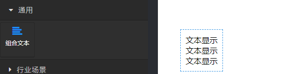
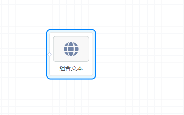
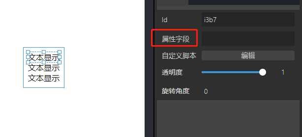
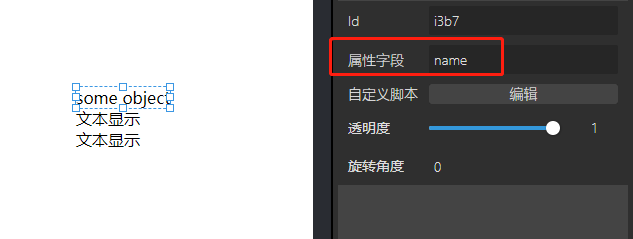
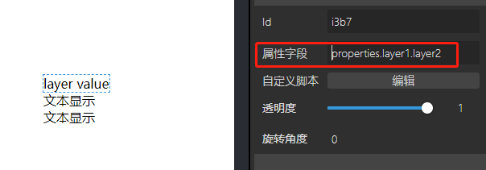
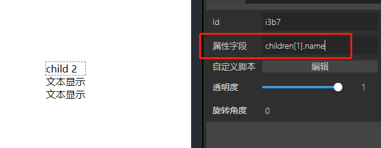

# 概览

## 前面板



## 后面板



## 数据

数据来源：后面板组件输入桩，接收 JSON 对象

# 功能说明

组合文本组件用于将 JSON 对象中的多个属性值一同展示。

从输入桩接收 JSON 对象，例如

```json
{
  "name": "some object",
  "properties": {
    "layer1": {
      "layer2": "layer value"
    }
  },
  "children": [{ "name": "child 1" }, { "name": "child 2" }]
}
```

对组合文本组件进行配置，选中组件中的每一个文本，修改其“属性字段”配置项


## 示例 1：显示对象名称“name”



## 示例 2：显示 layer2 属性的值。

由于 layer2 属性是嵌套属性，在 JSON 对象的访问中，如需访问到 layer2 属性的值，则会按照

```json
o.properties.layer1.layer2
```

（其中 o 代表 JSON 对象）的形式书写。

则在配置“属性字段”时，可以填入 properties.layer1.layer2，示例如下：


## 示例 3：显示 children 属性中某一项的值。

children 属性是一个数组，可以通过数组下标对其中的某个元素进行访问。如下所示，通过 children[1] 访问到 children 的第 2 个数组元素，进而访问其 name 属性。

