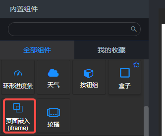
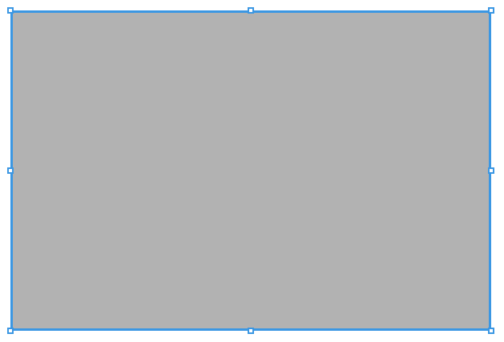
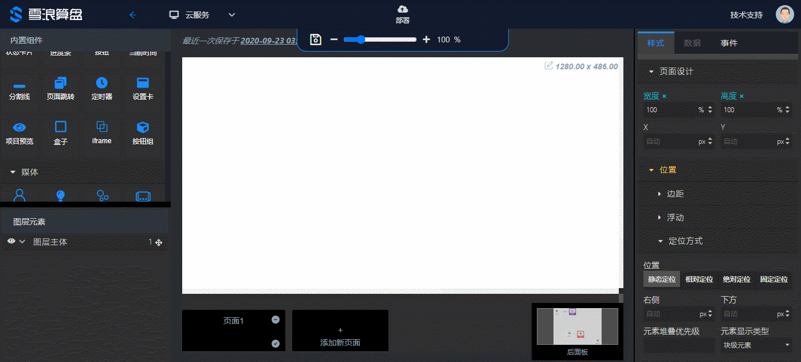

## 概览

### 内置组件/通用/Iframe

### 拖入画布后

- iframe组件是一个前端布局组件，不会在后面板生成任何节点。
- 默认背景色rgba(0, 0, 0, 0.3)，可以在右面板的 **样式/背景填充/背景色** 中修改设置。
- iframe中渲染的页面，在打开项目的前面板后才会渲染，在前面板编辑时，仅在页面布局中占位。

### 参数

- URL：
   - iframe中要渲染的页面的url地址，即iframe标签的src属性的值。
   - 支持模板字符串{{protocol}}、{{host}}、{{useId}}、{{appId}}、{{nodeId}}，其中的nodeId需要在“节点Id”参数中填写对应的后面板节点id。
- Name：iframe的name属性的值。
- 节点Id：url中对应的后面板节点id。若已填写，选中前面板的iframe组件后，切换到后面板，对应的后面板节点是选中状态。

### 演示

