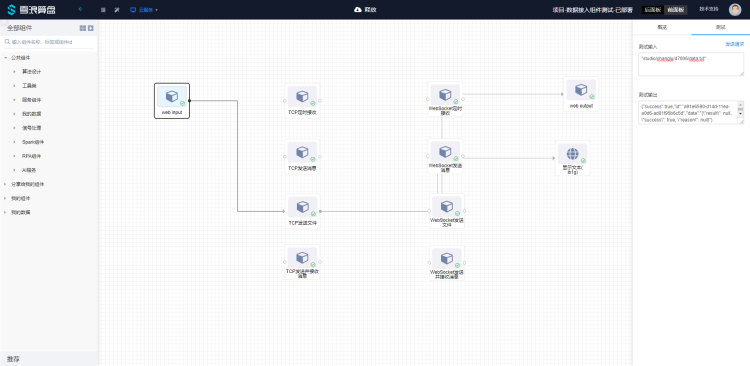

# TCP发送文件使用文档
| 组件名称 | TCP发送文件 |  |  |
| --- | --- | --- | --- |
| 工具集 | 网络通讯 |  |  |
| 组件作者 | 雪浪云-燕青 |  |  |
| 文档版本 | 1.0 |  |  |
| 功能 | 用于发送文件到TCP Server |  |  |
| 镜像名称 | data-access-module:0.2.17 |  |  |
| 开发语言 | Python |  |  |

## 组件原理
使用该组件实现发送文件到TCP Server的功能

## 输入桩

### 输入端子1

- **端口名称：** 输入数据
- **输入类型：** 所有类型，字符串
- **功能描述：** 算盘存储中的文件路径

## 输出桩

### 输出端子1

- **端口名称：** 输出数据
- **输出类型：** 所有类型
- **功能描述：** 文件发送成功后发送成功标识

## 参数配置

### ip
- **功能描述**：ip地址
- **必选参数**：是
- **默认值**：（无）

### port
- **功能描述**：端口
- **必选参数**：是
- **默认值**：（无）

### 文件结束标志符
- **功能描述**：文件结束标志符
- **必选参数**：是
- **默认值**：{\"end\": true}

## 使用示例

组件连接顺序如图所示，webinput weboutput 和前面板文本组件用来测试组件的输入输出，该组件要配置一个文件结束标志位参数，是为了让服务端知晓该文件发送完毕：


由于该组件为发送文件组件，从webinput输入的文件（文件路径）会发送至tcp服务端，如果发送成功会返回一个表示发送成功的json，如图所示：



服务端情况，会将文件内容保存在一个随机命名的文件中：


服务端实例代码（Python）：

```
import socket
import uuid
import json

TCP_IP = '127.0.0.1'
TCP_PORT = 5005
BUFFER_SIZE = 1024 

s = socket.socket(socket.AF_INET, socket.SOCK_STREAM)
s.bind((TCP_IP, TCP_PORT))
s.listen(1)


def reconnecting(s):
    while True:
        try:
            conn, addr = s.accept()
            return conn, addr
            break
        except Exception as e:
            print(str(e))


conn, addr = s.accept()
print('Connection address:', addr)

f = open(str(uuid.uuid1()), "wb")
count = 0
while True:
    chunk = conn.recv(1024)
    if chunk:
        try:
            print(chunk.decode("utf-8"))
            data = json.loads(chunk.decode("utf-8"))
            if data["end"]:
                f.close()
                print("finish")
                f = open(str(uuid.uuid1()), "wb")
                count = 0
        except Exception as e:
            print("write data file")
            f.write(chunk)
        finally:
            count += 1
    else:
        print("reconnecting...")
        conn, addr = reconnecting(s)

conn.close()

```