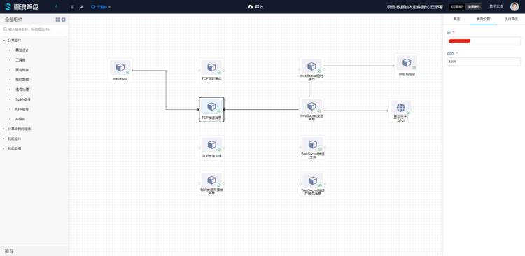
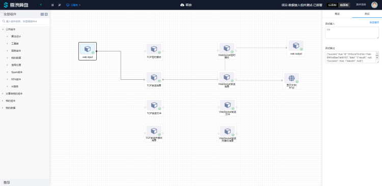
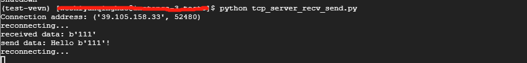

# TCP发送消息使用文档
| 组件名称 | TCP发送消息 |  |  |
| --- | --- | --- | --- |
| 工具集 | 网络通讯 |  |  |
| 组件作者 | 雪浪云-燕青 |  |  |
| 文档版本 | 1.0 |  |  |
| 功能 | 用于从上游接收数据发送到TCP server |  |  |
| 镜像名称 | data-access-module:0.2.17 |  |  |
| 开发语言 | Python |  |  |

## 组件原理
使用该组件实现从上游接收数据发送到TCP server的功能

## 输入桩
规定接收数据格式为Json，{"data":XXX}，XXX可以为字符串，int，float，数组等

### 输入端子1

- **端口名称：** 输入数据
- **输入类型：** 对象
- **功能描述：** 接收上游数据

## 输出桩

### 输出端子1

- **端口名称：** 输出数据
- **输出类型：** 所有类型
- **功能描述：** 消息发送成功后发送成功标识

## 参数配置

### ip
- **功能描述**：ip地址
- **必选参数**：是
- **默认值**：（无）

### port
- **功能描述**：端口
- **必选参数**：是
- **默认值**：（无）

## 使用示例

组件连接顺序如图所示，webinput weboutput 和前面板文本组件用来测试组件的输入输出：



由于该组件为发送数据组件，从webinput输入的数据会发送至tcp服务端，如果发送成功会返回一个表示发送成功的json，如图所示：



可以直接在前面板看到输出：


服务端情况如图：



服务端实例代码（Python）：

```
import socket
import time

TCP_IP = '127.0.0.1'
TCP_PORT = 5005
BUFFER_SIZE = 1024

s = socket.socket(socket.AF_INET, socket.SOCK_STREAM)
s.bind((TCP_IP, TCP_PORT))
s.listen(1)


def reconnecting(s):
    while True:
        try:
            conn, addr = s.accept()
            return conn, addr
            break
        except Exception as e:
            print(str(e))


conn, addr = s.accept()
print('Connection address:', addr)

while True:
    try:
        data = conn.recv(BUFFER_SIZE)
        if data:
            print("received data:", data)
        else:
            print("reconnecting...")
            conn, addr = reconnecting(s)
        greeting = f"Hello {data}!"
        if data:
            conn.send(bytes(greeting.encode("utf-8")))
            print("send data:", greeting)

    except KeyboardInterrupt:
        print("close")
        break

conn.close()

```