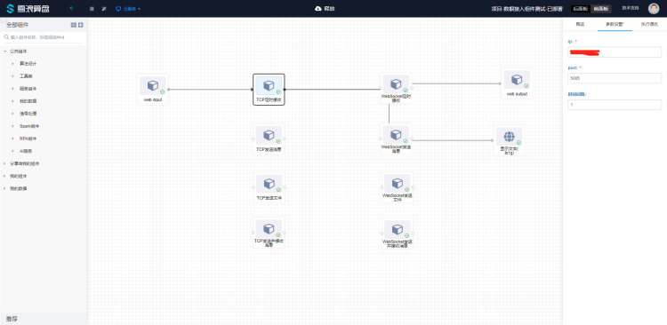
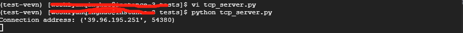

# TCP定时接收使用文档
| 组件名称 | TCP定时接收 |  |  |
| --- | --- | --- | --- |
| 工具集 | 网络通讯 |  |  |
| 组件作者 | 雪浪云-燕青 |  |  |
| 文档版本 | 1.0 |  |  |
| 功能 | 用于定时接收tcp消息 |  |  |
| 镜像名称 | data-access-module:0.2.17 |  |  |
| 开发语言 | Python |  |  |

## 组件原理
使用该组件实现定时接收tcp消息的功能

## 输入桩

无

## 输出桩

### 输出端子1

- **端口名称：** 输出数据
- **输出类型：** 所有类型，字符串
- **功能描述：** 输出接收到的字符串

## 参数配置

### ip
- **功能描述**：ip地址
- **必选参数**：是
- **默认值**：（无）

### port
- **功能描述**：端口
- **必选参数**：是
- **默认值**：（无）

### 时间间隔
- **功能描述**：接收时间间隔
- **必选参数**：是
- **默认值**（无）

## 使用示例

组件连接顺序如图所示，webinput weboutput 和前面板文本组件用来测试组件的输入输出：



由于该组件为自动接收数据组件，会定时触发从tcp服务端接收数据，可以直接从前面板观察数据变化情况，如图所示：


服务端的情况如图所示（检测连接成功）：



服务端实例代码（Python）：

```
import socket
import time

TCP_IP = '127.0.0.1'
TCP_PORT = 5005
BUFFER_SIZE = 1024

s = socket.socket(socket.AF_INET, socket.SOCK_STREAM)
s.bind((TCP_IP, TCP_PORT))
s.listen(1)


def reconnecting(s):
    while True:
        try:
            conn, addr = s.accept()
            return conn, addr
            break
        except Exception as e:
            print(str(e))


conn, addr = s.accept()
print('Connection address:', addr)
count = 0

while True:
    try:
        out = str(count)
        conn.send(bytes(out.encode("utf-8")))
        count += 1
        time.sleep(1)
    except KeyboardInterrupt:
        print("close")
        break

conn.close()

```