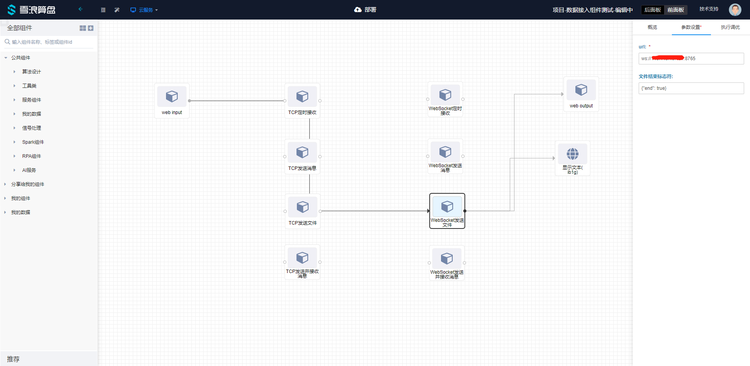
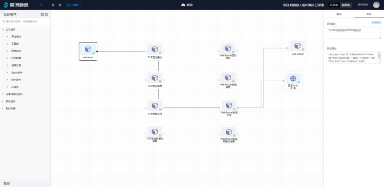
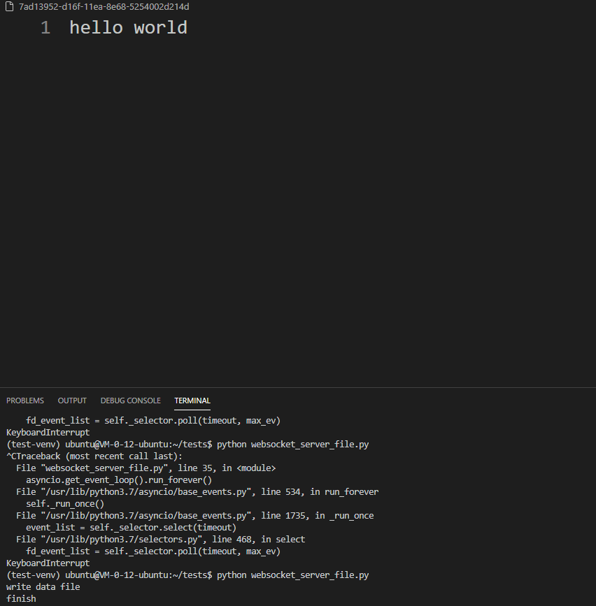

# WebSocket发送文件使用文档
| 组件名称 | WebSocket发送文件 |  |  |
| --- | --- | --- | --- |
| 工具集 | 网络通讯 |  |  |
| 组件作者 | 雪浪云-燕青 |  |  |
| 文档版本 | 1.0 |  |  |
| 功能 | 用于发送文件到Websocket Server |  |  |
| 镜像名称 | data-access-module:0.2.17 |  |  |
| 开发语言 | Python |  |  |

## 组件原理
使用该组件实现发送文件到Websocket Server的功能

## 输入桩

### 输入端子1

- **端口名称：** 输入数据
- **输入类型：** 所有类型，字符串
- **功能描述：** 算盘存储中的文件路径

## 输出桩

### 输出端子1

- **端口名称：** 输出数据
- **输出类型：** 对象
- **功能描述：** 文件发送成功后发送成功标识

## 参数配置

### url
- **功能描述**：websocket server地址
- **必选参数**：是
- **默认值**：（无）

### 文件结束标志符
- **功能描述**：文件结束标志符
- **必选参数**：是
- **默认值**：{\"end\": true}

## 使用示例

组件连接顺序如图所示，webinput weboutput 和前面板文本组件用来测试组件的输入输出：



由于该组件为发送文件组件，会发从webinput组件拿到文件地址并将二进制文件发送至websocket服务端，返回一个表示是否发送成功的json，如图所示：



服务端的情况如图所示：



服务端示例代码（Python）：

```
import asyncio
import time
import uuid
import json
import websockets
import logging
logger = logging.getLogger('websockets.server')
logger.setLevel(logging.ERROR)
logger.addHandler(logging.StreamHandler())


async def hello(websocket, path):
    f = open(str(uuid.uuid1()), "wb")
    count = 0
    while True:
        chunk = await websocket.recv()
        try:
            data = json.loads(chunk.decode("utf-8"))
            if data["end"]:
                f.close()
                print("finish")
                f = open(str(uuid.uuid1()), "wb")
                count = 0
        except Exception as e:
            print("write data file")
            f.write(chunk)
        finally:
            count += 1


start_server = websockets.serve(hello, "0.0.0.0", 8765)

asyncio.get_event_loop().run_until_complete(start_server)
asyncio.get_event_loop().run_forever()

```
