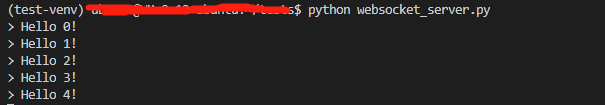

# WebSocket定时接收使用文档
| 组件名称 | WebSocket定时接收 |  |  |
| --- | --- | --- | --- |
| 工具集 | 网络通讯 |  |  |
| 组件作者 | 雪浪云-燕青 |  |  |
| 文档版本 | 1.0 |  |  |
| 功能 | 用于定时接收WebSocket消息 |  |  |
| 镜像名称 | data-access-module:0.2.17 |  |  |
| 开发语言 | Python |  |  |

## 组件原理
使用该组件实现定时接收WebSocket消息的功能

## 输入桩

无

## 输出桩

### 输出端子1

- **端口名称：** 输出数据
- **输出类型：** 字符串
- **功能描述：** 将定时接收的websocket字符串发送给下游组件

## 参数配置

### url
- **功能描述**：websocket server地址
- **必选参数**：是
- **默认值**：（无）

### 时间间隔
- **功能描述**：数据接收时间间隔
- **必选参数**：是
- **默认值**：1

## 使用示例

组件连接顺序如图所示，webinput weboutput 和前面板文本组件用来测试组件的输入输出：


由于该组件为自动接收数据组件，会定时触发从websocket服务端接收数据，可以直接从前面板观察数据变化情况，如图所示：


服务端的情况如图所示：



服务端示例代码（Python）：

```
import asyncio
import time
import websockets
import logging
logger = logging.getLogger('websockets.server')
logger.setLevel(logging.ERROR)
logger.addHandler(logging.StreamHandler())


async def hello(websocket, path):
    count = 0
    while True:

        greeting = f"Hello {count}!"

        await websocket.send(greeting)
        print(f"> {greeting}")
        count += 1
        await asyncio.sleep(1)


start_server = websockets.serve(hello, "0.0.0.0", 8765)

asyncio.get_event_loop().run_until_complete(start_server)
asyncio.get_event_loop().run_forever()

```
