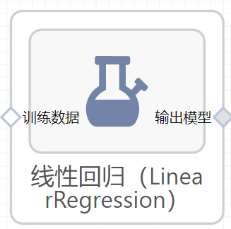

# 线性回归（LinearRegression）使用文档
| 组件名称 | 线性回归（LinearRegression） |  |  |
| --- | --- | --- | --- |
| 工具集 | 机器学习 |  |  |
| 组件作者 | 雪浪云-墨文 |  |  |
| 文档版本 | 1.0 |  |  |
| 功能 | 线性回归（LinearRegression）算法 |  |  |
| 镜像名称 | ml_components:3 |  |  |
| 开发语言 | Python |  |  |

## 组件原理
在统计学中，线性回归是一种建模因变量与一个或多个解释变量(或自变量)之间关系的线性方法。一个解释变量的情况称为简单线性回归。对于一个以上的解释变量，这个过程称为多元线性回归。这一项不同于多变量线性回归，多变量线性回归预测多个因变量，而不是单个因变量。

在线性回归中，利用线性预测函数对关系进行建模，预测函数的未知模型参数由数据估计得到。这种模型称为线性模型。最常见的情况是，给定解释变量(或预测因子)的值的响应的条件平均值假定为这些值的仿射函数;不太常用的是条件中位数或其他分位数。与所有形式的回归分析一样，线性回归关注给定预测因子值响应的条件概率分布，而不是多元分析中的所有变量的联合概率分布。

线性回归是第一种需要严格研究并在实际应用中得到广泛应用的回归分析方法。这是因为线性依赖于其未知参数的模型比与参数非线性相关的模型更容易拟合，而且结果估计量的统计特性更容易确定。
线性回归有许多实际用途。可以分为以下两大类:

- 如果目标是预测，或减少误差，线性回归可用于建立预测模型，匹配响应值和解释变量的观测数据集之间的关系。建立该模型后，如果在没有相应响应值的情况下收集解释变量的附加值，则可以使用拟合模型对响应进行预测。
- 如果目的是将响应变量的变化归因于解释变量的变化,线性回归分析可以应用于量化响应变量和解释变量之间的关系的强度,特别是一些解释性变量与响应变量是否可能没有线性关系,或确定解释变量的子集可能包含的冗余信息。

线性回归模型通常使用最小二乘拟合的方法,但是也可以使用其他方法拟合,比如在其他范数的基础上最小化“失拟项”(如最小绝对偏差回归),或最小化最小二乘法增加惩罚项的代价函数像岭回归(L2范数惩罚项)和Lasso(L1范数惩罚项)。相反，最小二乘法可用于拟合非线性模型。因此，尽管术语“最小二乘”和“线性模型”是紧密联系的，但它们并不是同义词。

## 输入桩
支持单个csv文件输入。
### 输入端子1

- **端口名称**：训练数据
- **输入类型**：Csv文件
- **功能描述**： 输入用于训练的数据
## 输出桩
支持sklearn模型输出。
### 输出端子1

- **端口名称**：输出模型
- **输出类型**：sklearn模型
- **功能描述**： 输出训练好的模型用于预测
## 参数配置
### Fit Intercept

- **功能描述**：是否计算该模型的截距。
- **必选参数**：是
- **默认值**：是
### normalize

- **功能描述**：当fit_intercept设置为False时，将忽略该参数。若为真，则回归前对回归量X进行归一化处理，取均值减去后除以l2-范数。
- **必选参数**：是
- **默认值**：否
### Copy X

- **功能描述**：如果为真，则复制X;否则，它可能被覆盖。
- **必选参数**：是
- **默认值**：是
### N Jobs

- **功能描述**：用于计算的作业数。
- **必选参数**：否
- **默认值**：（无）
### 需要训练

- **功能描述**：该模型是否需要训练，默认为需要训练。
- **必选参数**：是
- **默认值**：是
## 使用方法
- 将组件拖入到项目中
- 与前一个组件输出的端口连接（必须是csv类型）
- 点击运行该节点

