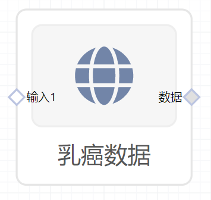

# 乳癌数据使用文档
| 组件名称 | 乳癌数据 |  |  |
| --- | --- | --- | --- |
| 工具集 | 数据读写/常用数据集 |  |  |
| 组件作者 | 雪浪云-墨文 |  |  |
| 文档版本 | 1.0 |  |  |
| 功能 | 用于获取通用数据集-乳癌数据 |  |  |
| 镜像名称 | ml_components:3 |  |  |
| 开发语言 | Python |  |  |

## 组件原理
使用该组件实现将乳癌数据下发给后续组件使用

- 输出乳癌数据。数据集包括569个乳癌样本数据
- 数据描述
    - radius：从中心到周长上的点的距离的平均值
    - texture：灰度值的标准偏差
    - perimeter：样本的周长
    - area：样本的面积
    - smoothness：平滑度，半径长度的局部变化
    - compactness ：样本的紧凑度
    - concavity ：凹度，轮廓线凹陷部分的严重程度
    - concave_points：凹点，轮廓线凹陷部分的数量
    - symmetry：样本的对称性
    - fractal_dimension：样本的分形锥度

## 输入桩
无

## 输出桩
支持单个csv文件输出。
### 输出端子1

- **端口名称：** 数据
- **输出类型：** Csv文件
- **功能描述：** 输出乳癌数据

## 参数配置
### 输出结果

- **功能描述**： 查看结果数据
- **必选参数**： 是
- **默认值**： 无

## 使用方法
- 将组件拖入到项目中
- 与后一个组件输入的端口连接（必须是csv类型）
- 组件输入不需要连接其他节点
- 点击运行该节点

