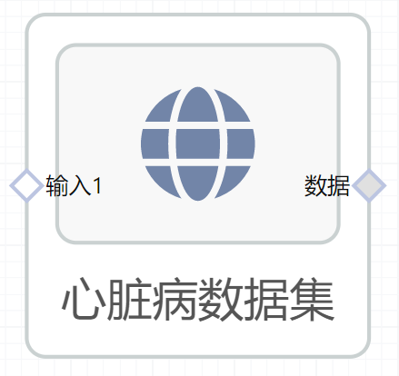

# 心脏病数据集使用文档
| 组件名称 |心脏病数据集 |  |  |
| --- | --- | --- | --- |
| 工具集 | 数据读写/常用数据集 |  |  |
| 组件作者 | 雪浪云-墨文 |  |  |
| 文档版本 | 1.0 |  |  |
| 功能 | 用于获取通用数据集-心脏病数据集 |  |  |
| 镜像名称 | ml_components:3 |  |  |
| 开发语言 | Python |  |  |

## 组件原理
使用该组件实现将心脏病数据集下发给后续组件使用

- 输出心脏病数据集，克利夫兰数据库是迄今为止唯一被ML研究人员使用的数据库。
- 数据描述
    - Age：年龄
    - Sex：性别
    - id：病人识别号
    - ccf ：社会保险号
    - painloc：胸痛位置
    - chol：血清胆红素
    - cmo：心电图检查的月份
    - cday：心电图检查的日子
    - cyr：心电图检查的年份
    - thaldur: 运动测试的持续时间

## 输入桩
无

## 输出桩
支持单个csv文件输出。
### 输出端子1

- **端口名称：** 数据
- **输出类型：** Csv文件
- **功能描述：** 输出心脏病数据集

## 参数配置
### 输出结果

- **功能描述**： 查看结果数据
- **必选参数**： 是
- **默认值**： 无

## 使用方法
- 将组件拖入到项目中
- 与后一个组件输入的端口连接（必须是csv类型）
- 组件输入不需要连接其他节点
- 点击运行该节点

