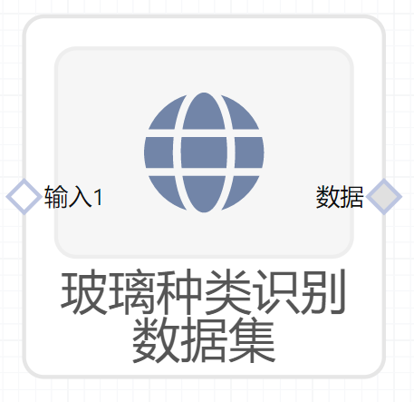

# 玻璃种类识别数据集使用文档
| 组件名称 |玻璃种类识别数据集 |  |  |
| --- | --- | --- | --- |
| 工具集 | 数据读写/常用数据集 |  |  |
| 组件作者 | 雪浪云-墨文 |  |  |
| 文档版本 | 1.0 |  |  |
| 功能 | 用于获取通用数据集-玻璃种类识别数据集 |  |  |
| 镜像名称 | ml_components:3 |  |  |
| 开发语言 | Python |  |  |

## 组件原理
使用该组件实现将玻璃种类识别数据集下发给后续组件使用

- 输出玻璃种类识别数据集，这个组件可以输出玻璃特征数据，适用于分类算法，预测玻璃的种类
- 数据描述
     - id
     - Ri：折射率
     - Na：钠（单位度量:相应氧化物的重量百分比）
     - Mg：镁（单位度量:相应氧化物的重量百分比）
     - Al：铝（单位度量:相应氧化物的重量百分比）
     - Si：硅（单位度量:相应氧化物的重量百分比）
     - K：钾（单位度量:相应氧化物的重量百分比）
     - Ca：钙（单位度量:相应氧化物的重量百分比）
     - Ba：钡（单位度量:相应氧化物的重量百分比）
     - Fe：铁（单位度量:相应氧化物的重量百分比）
     - Type of glass：玻璃种类

## 输入桩
无

## 输出桩
支持单个csv文件输出。
### 输出端子1

- **端口名称：** 数据
- **输出类型：** Csv文件
- **功能描述：** 输出玻璃种类识别数据集

## 参数配置
### 输出结果

- **功能描述**： 查看结果数据
- **必选参数**： 是
- **默认值**： 无

## 使用方法
- 将组件拖入到项目中
- 与后一个组件输入的端口连接（必须是csv类型）
- 组件输入不需要连接其他节点
- 点击运行该节点

