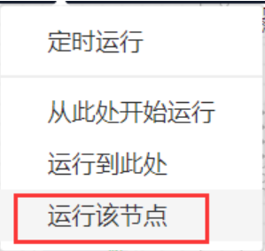

# 纽约Airbnb数据集使用文档
| 组件名称 |纽约Airbnb数据集 |  |  |
| --- | --- | --- | --- |
| 工具集 | 数据读写/常用数据集 |  |  |
| 组件作者 | 雪浪云-墨文 |  |  |
| 文档版本 | 1.0 |  |  |
| 功能 | 用于获取通用数据集-纽约Airbnb数据集 |  |  |
| 镜像名称 | ml_components:3 |  |  |
| 开发语言 | Python |  |  |

## 组件原理
使用该组件实现将纽约Airbnb数据集下发给后续组件使用

- 输出纽约Airbnb数据集，这个组件可以输出纽约airbnb的数据，可以探索哪些host是最忙的，忙碌的原因以及预测价格等等
- 数据描述
    -  name：列表中的名称
    - host_id：房东id
    - host_name：房东名称
    - neighbourhood_group：位置
    - neighbourhood：地区
    - latitude：维度
    - longitude：经度
    - room_type：房间类型
    - price：房价
    - minimum_nights：最少可租的夜晚
    - number_of_reviews：评论数
    - last_review：最近评论时间
    - reviews_per_month：每月评论数
    - calculated_host_listings_count：房东可以出租的数量
    - availability_365：每年可以租用的时间（天数）

## 输入桩
无

## 输出桩
支持单个csv文件输出。
### 输出端子1

- **端口名称：** 数据
- **输出类型：** Csv文件
- **功能描述：** 输出纽约Airbnb数据集

## 参数配置
### 输出结果

- **功能描述**： 查看结果数据
- **必选参数**： 是
- **默认值**： 无

## 使用方法
- 将组件拖入到项目中
- 与后一个组件输入的端口连接（必须是csv类型）
- 组件输入不需要连接其他节点
- 点击运行该节点

