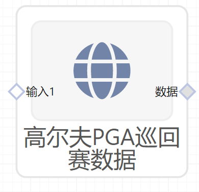

# 高尔夫PGA巡回赛数据使用文档
| 组件名称 | 高尔夫PGA巡回赛数据 |  |  |
| --- | --- | --- | --- |
| 工具集 | 数据读写/常用数据集 |  |  |
| 组件作者 | 雪浪云-墨文 |  |  |
| 文档版本 | 1.0 |  |  |
| 功能 | 用于获取通用数据集-高尔夫PGA巡回赛数据 |  |  |
| 镜像名称 | ml_components:3 |  |  |
| 开发语言 | Python |  |  |

## 组件原理
使用该组件实现将高尔夫PGA巡回赛数据下发给后续组件使用

- 输出2019年1月至2019年8月之间的PGA巡回赛数据数据
- 数据描述
    - name：选手名字
    - avg_footage：平均推进长度
    - 3feet：3英尺内进球率
    - 3_5feet：3-5英尺进球率
    - 5_10feet：5-10英尺进球率
    - 10_20feet：10-20英尺进球率
    - 20+feet：20英尺以上进球率
    - avg_potts_perround：平均每场推数
    - Potts/gir：推/果岭
    - avg_GIR：平均上果岭率
    - avg_GIR_perround：平均上果岭率（每场）

## 输入桩
无

## 输出桩
支持单个csv文件输出。
### 输出端子1

- **端口名称：** 数据
- **输出类型：** Csv文件
- **功能描述：** 输出高尔夫PGA巡回赛数据

## 参数配置
### 输出结果

- **功能描述**： 查看结果数据
- **必选参数**： 是
- **默认值**： 无

## 使用方法
- 将组件拖入到项目中
- 与后一个组件输入的端口连接（必须是csv类型）
- 组件输入不需要连接其他节点
- 点击运行该节点

