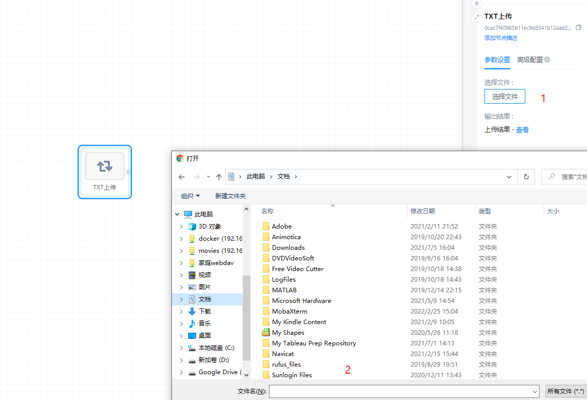
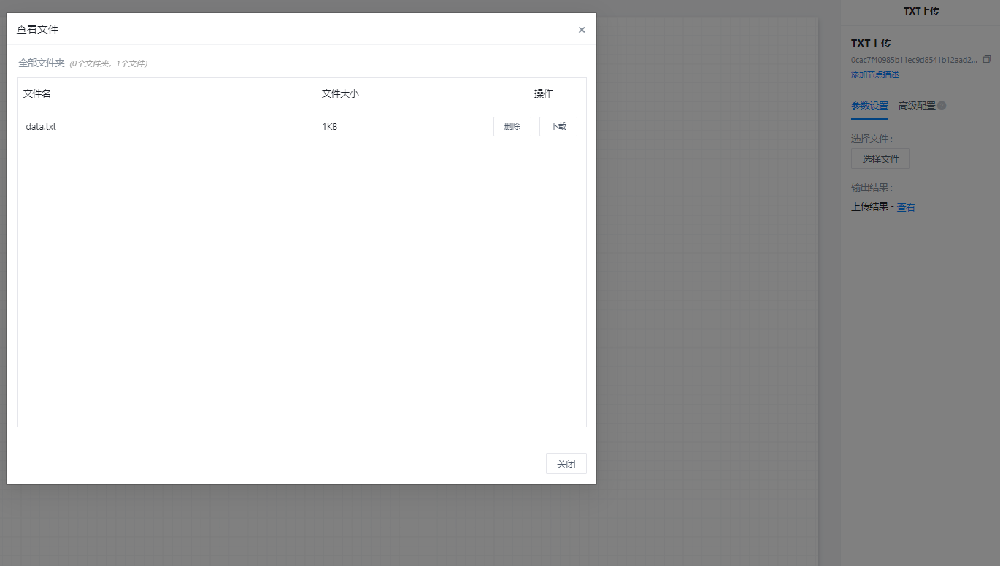

# TXT上传使用文档
| 组件名称 | TXT上传 |  |  |
| --- | --- | --- | --- |
| 工具集 | 数据读写/本地数据 |  |  |
| 组件作者 | 雪浪云-奔豚 |  |  |
| 文档版本 | 1.0 |  |  |
| 功能 | 用于上传txt文件 |  |  |
| 镜像名称 | 无 |  |  |
| 开发语言 | JavaScript |  |  |

## 组件原理
使用该组件实现txt文件上传至算盘机器学习模板

## 输入桩
无

## 输出桩
支持单个txt文件输出。
### 输出端子1

- **端口名称：** 已上传数据
- **输出类型：** Txt文件
- **功能描述：** 输出txt文件

## 参数配置
### 选择文件

- **功能描述：** 选择某个需要上传至组件的txt本地文件，上传后文件会被重命名为data.txt
- **必选参数：** 是
- **默认值：** 无

### 输出结果

- **功能描述：** 查看已上传txt文件
- **必选参数：** 是
- **默认值：** 无

## 使用方法

