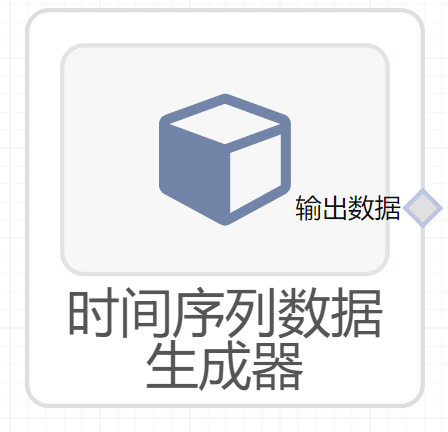

# 时间序列数据生成器使用文档
| 组件名称 | 时间序列数据生成器|  |  |
| --- | --- | --- | --- |
| 工具集 | 数据读写 |  |  |
| 组件作者 | 雪浪云-墨文 |  |  |
| 文档版本 | 1.0 |  |  |
| 功能 |时间序列数据生成器 |  |  |
| 镜像名称 | mllib_components:3 |  |  |
| 开发语言 | Python |  |  |

## 组件原理
这个组件可以随机生成时间序列数据
## 输入桩
该组件没有输入

## 输出桩
支持Csv文件输出。
### 输出端子1

- **端口名称：** 输出数据
- **输出类型：** Csv文件
- **功能描述：** 输出生成的数据集
## 参数配置
### ar

- **功能描述：** 生成数据的ar参数
- **必选参数：** 是
- **默认值：** 0.75，-0.25
### ma

- **功能描述：** 生成数据的ma参数
- **必选参数：** 是
- **默认值：** 0.65，0.35
### nsample

- **功能描述：** 生成数据的样本数
- **必选参数：** 是
- **默认值：** 250
### sigma

- **功能描述：** 生成数据的sigma参数
- **必选参数：** 是
- **默认值：** 1
### randomSeed

- **功能描述：** 随机种子
- **必选参数：** 是
- **默认值：** 12345
### need date

- **功能描述：** 是否需要日期
- **必选参数：** 是
- **默认值：** true
### startDate

- **功能描述：** 起始日期
- **必选参数：** 是
- **默认值：** 19800131

## 使用方法
- 加组件拖入到项目中
- 与后一个组件输入的端口连接（必须是csv类型）
- 组件输入不需要连接其他节点
- 填写参数
- 点击运行该节点

