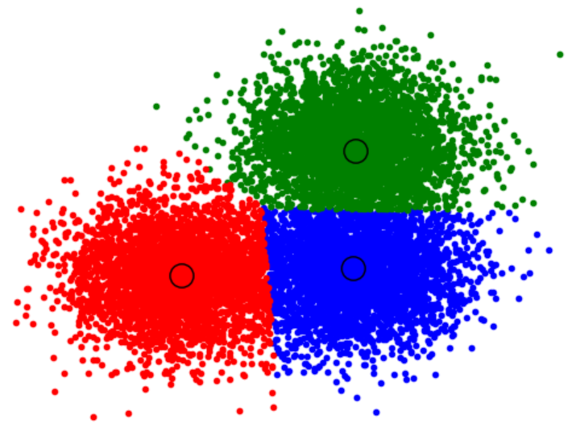

# 随机生成块状数据集使用文档
| 组件名称 | 随机生成块状数据集|  |  |
| --- | --- | --- | --- |
| 工具集 | 数据读写 |  |  |
| 组件作者 | 雪浪云-墨文 |  |  |
| 文档版本 | 1.0 |  |  |
| 功能 |随机生成块状数据集 |  |  |
| 镜像名称 | ml_components:3 |  |  |
| 开发语言 | Python |  |  |

## 组件原理
这个组件可以随机生成块状数据，适用于聚类
## 输入桩
该组件没有输入

## 输出桩
支持Csv文件输出。
### 输出端子1

- **端口名称：** 输出数据
- **输出类型：** Csv文件
- **功能描述：** 输出生成的数据集
## 参数配置
### 总个数

- **功能描述：** 生成数据的总个数
- **必选参数：** 是
- **默认值：** 100
### 特征数

- **功能描述：** 生成数据的特征数
- **必选参数：** 是
- **默认值：** 2
### 中心数

- **功能描述：** 生成的数据的中心数目
- **必选参数：** 是
- **默认值：** 1
### 聚类标准差

- **功能描述：** 聚类的标准差
- **必选参数：** 是
- **默认值：** 1.0
### 中心边界下限

- **功能描述：** 生成数据的特征数
- **必选参数：** 是
- **默认值：** -10
### 中心边界上限

- **功能描述：** 中心边界上限
- **必选参数：** 是
- **默认值：** 10
### shuffile

- **功能描述：** 中心点的范围
- **必选参数：** 是
- **默认值：** true
### Random State

- **功能描述：** 打乱生成数据
- **必选参数：** 否
- **默认值：** （无）

## 使用方法
- 加组件拖入到项目中
- 与后一个组件输入的端口连接（必须是csv类型）
- 组件输入不需要连接其他节点
- 填写参数
- 点击运行该节点

## 生成数据示意

随机生成的数据如下所示：

