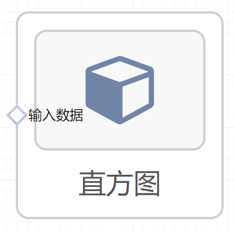
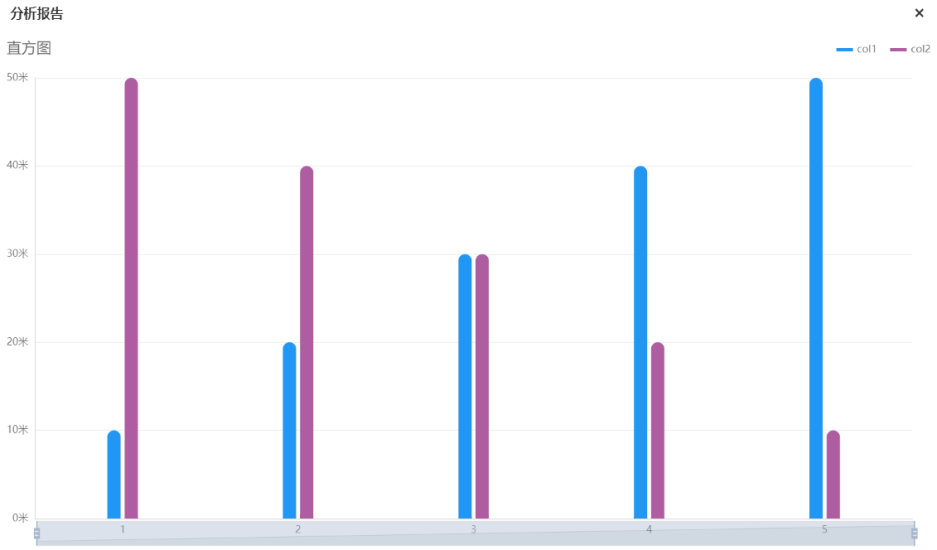

# 直方图使用文档
| 组件名称 | 直方图|  |  |
| --- | --- | --- | --- |
| 工具集 | 数据可视化 |  |  |
| 组件作者 | 雪浪云-墨文 |  |  |
| 文档版本 | 1.0 |  |  |
| 功能 |绘制直方图 |  |  |
| 镜像名称 | ml_components:3 |  |  |
| 开发语言 | Python |  |  |

## 组件原理
这个组件可以将输入的数据展现为直方图的形式。
## 输入桩
支持单个csv文件输入。
### 输入端子1

- **端口名称：** 输入数据
- **输出类型：** Csv文件
- **功能描述：** 需要绘图的数据

## 输出桩
支持echarts文件输出。
### 输出端子1

- **端口名称：** 直方图
- **输出类型：** echarts文件
- **功能描述：** 输出绘制的图像
## 参数配置
### 标题

- **功能描述：** 可视化图形标题
- **必选参数：** 否
- **默认值：** （无）
### 单位

- **功能描述：** 数据单位
- **必选参数：** 是
- **默认值：** （无）
### X轴字段

- **功能描述：** 用于生成图形X轴的字段
- **必选参数：** 是
- **默认值：** （无）
### Y轴字段

- **功能描述：** 用于生成图形Y轴的字段
- **必选参数：** 是
- **默认值：** （无）

## 使用方法
- 加组件拖入到项目中
- 与前一个组件输出的端口连接（必须是csv类型）
- 组件输出不需要连接其他节点
- 填写参数
- 点击运行该节点
- 在参数设置 -> 输出结果中点击查看

## 使用示例
该组件的数据展示样例如下所示

