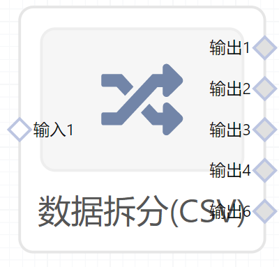

# 数据拆分（CSV）使用文档
| 组件名称 | 数据拆分（CSV）|  |  |
| --- | --- | --- | --- |
| 工具集 | 数据处理 |  |  |
| 组件作者 | 雪浪云-墨文 |  |  |
| 文档版本 | 1.0 |  |  |
| 功能 |拆分数据 |  |  |
| 镜像名称 | ml_components:3 |  |  |
| 开发语言 | Python |  |  |

## 组件原理
将输入的文件拆分为多个文件。
## 输入桩
支持单个csv文件输入。
### 输入端子1

- **端口名称：** 输入1
- **输出类型：** Csv文件
- **功能描述：** 需要拆分的数据

## 输出桩
支持Csv文件输出。
### 输出端子1

- **端口名称：** 输出1
- **输出类型：** Csv文件
- **功能描述：** 输出拆分的的结果
### 输出端子2

- **端口名称：** 输出2
- **输出类型：** Csv文件
- **功能描述：** 输出拆分的的结果
### 输出端子3

- **端口名称：** 输出3
- **输出类型：** Csv文件
- **功能描述：** 输出拆分的的结果
### 输出端子4

- **端口名称：** 输出4
- **输出类型：** Csv文件
- **功能描述：** 输出拆分的的结果
### 输出端子5

- **端口名称：** 输出5
- **输出类型：** Csv文件
- **功能描述：** 输出拆分的的结果
## 参数配置
### 数据1比重

- **功能描述：** 数据1比重
- **必选参数：** 是
- **默认值：** （无）
### 数据2比重

- **功能描述：** 数据2比重
- **必选参数：** 是
- **默认值：** （无）
### 数据3比重

- **功能描述：** 数据3比重
- **必选参数：** 是
- **默认值：** （无）
### 数据4比重

- **功能描述：** 数据4比重
- **必选参数：** 是
- **默认值：** （无）
### 数据5比重

- **功能描述：** 数据5比重
- **必选参数：** 是
- **默认值：** （无）

## 使用方法
- 加组件拖入到项目中
- 与前一个组件输出的端口连接（必须是csv类型）
- 点击运行该节点

