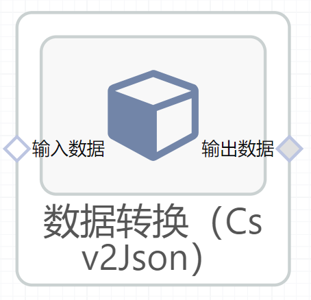

# 数据转换（Csv2Json）使用文档
| 组件名称 | 数据转换（Csv2Json）|  |  |
| --- | --- | --- | --- |
| 工具集 | 数据处理 |  |  |
| 组件作者 | 雪浪云-墨文 |  |  |
| 文档版本 | 1.0 |  |  |
| 功能 |数据转换（Csv2Json） |  |  |
| 镜像名称 | ml_components:3 |  |  |
| 开发语言 | Python |  |  |

## 组件原理
将输入的csv文件转换成json字符串输出到下一个节点
## 输入桩
支持单个csv文件输入。
### 输入端子1
- **端口名称：** 输入数据
- **输出类型：** csv文件
- **功能描述：** 需要转换的文件

## 输出桩
支持json格式输出。
### 输出端子1

- **端口名称：** 输出数据
- **输出类型：** json文件
- **功能描述：** 输出转换后的文件

## 参数配置
### 选中字段

- **功能描述：** 选中的csv文件中的字段
- **必选参数：** 是
- **默认值：** （无）
### 返回行数

- **功能描述：** 返回数据的行数，例如填100，则输出文件前100行的数据
- **必选参数：** 是
- **默认值：** （无）
### 选中行号

- **功能描述：** 选中某一行输出，与上一个'返回行数'参数冲突，只能同时填写一项
- **必选参数：** 是
- **默认值：** （无）
### 输出格式

- **功能描述：** 选择输出格式
- **必选参数：** 是
- **默认值：** echarts
### 包含索引

- **功能描述：** 是否将数据中的索引一起在json中输出
- **必选参数：** 是
- **默认值：** false

## 使用方法
- 加组件拖入到项目中
- 与前一个组件输出的端口连接
- 点击运行该节点

