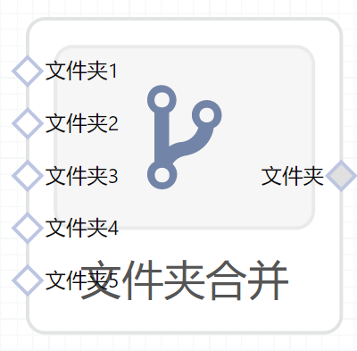

# 文件夹合并使用文档
| 组件名称 | 文件夹合并|  |  |
| --- | --- | --- | --- |
| 工具集 | 数据处理 |  |  |
| 组件作者 | 雪浪云-墨文 |  |  |
| 文档版本 | 1.0 |  |  |
| 功能 |合并文件夹 |  |  |
| 镜像名称 | ml_components:3 |  |  |
| 开发语言 | Python |  |  |

## 组件原理
将多个文件夹合并成一个文件夹。
## 输入桩
支持多个files文件输入。
### 输入端子1

- **端口名称：** 文件夹1
- **输出类型：** files文件
- **功能描述：** 需要合并的文件夹
### 输入端子2

- **端口名称：** 文件夹2
- **输出类型：** files文件
- **功能描述：** 需要合并的文件夹
### 输入端子3

- **端口名称：** 文件夹3
- **输出类型：** files文件
- **功能描述：** 需要合并的文件夹
### 输入端子4

- **端口名称：** 文件夹4
- **输出类型：** files文件
- **功能描述：** 需要合并的文件夹
### 输入端子5

- **端口名称：** 文件夹5
- **输出类型：** files文件
- **功能描述：** 需要合并的文件夹

## 输出桩
支持folder文件输出。
### 输出端子1

- **端口名称：** 输出1
- **输出类型：** folder文件
- **功能描述：** 输出合并的文件夹

## 使用方法
- 加组件拖入到项目中
- 与前一个组件输出的端口连接
- 点击运行该节点

