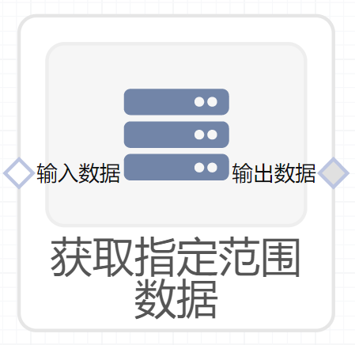

# 获取指定范围数据使用文档
| 组件名称 | 获取指定范围数据|  |  |
| --- | --- | --- | --- |
| 工具集 | 数据处理 |  |  |
| 组件作者 | 雪浪云-墨文 |  |  |
| 文档版本 | 1.0 |  |  |
| 功能 |获取指定范围数据 |  |  |
| 镜像名称 | ml_components:3 |  |  |
| 开发语言 | Python |  |  |

## 组件原理
该组件用于按照输入的索引范围，获取相应范围的数据。
## 输入桩
支持单个csv文件输入。
### 输入端子1

- **端口名称：** 输入数据
- **输出类型：** Csv文件
- **功能描述：** 需要索引的数据

## 输出桩
支持Csv文件输出。
### 输出端子1

- **端口名称：** 输出数据
- **输出类型：** Csv文件
- **功能描述：** 输出索引的结果

## 参数配置
### 起始位置

- **功能描述：** 起始索引位置，索引从0开始
- **必选参数：** 是
- **默认值：** （无）
### 结束位置

- **功能描述：** 结束索引位置
- **必选参数：** 是
- **默认值：** （无）

## 使用方法
- 加组件拖入到项目中
- 与前一个组件输出的端口连接（必须是csv类型）
- 点击运行该节点

