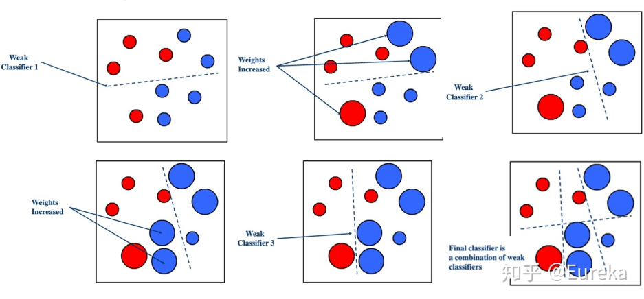
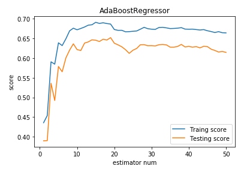

# AdaBoost分类（AdaBoostClassifier）使用文档
| 组件名称 |AdaBoost分类（AdaBoostClassifier）|  |  |
| --- | --- | --- | --- |
| 工具集 | 机器学习 |  |  |
| 组件作者 | 雪浪云-墨文 |  |  |
| 文档版本 | 1.0 |  |  |
| 功能 | AdaBoost分类（AdaBoostClassifier）算法|  |  |
| 镜像名称 | ml_components:3 |  |  |
| 开发语言 | Python |  |  |

## 组件原理
Boosting族算法的工作机制为：先从初始训练集中训练出一个基学习器，再根据基学习器的表现对训练样本分布进行调整，然后基于调整后的样本分布来训练下一个基学习器；重复进行，直到基学习器数目达到事先指定的值；最终将所有基学习器根据结合策略结合，得到最终的强学习器。

Boosting中的基学习器是弱学习器，即仅仅比随机猜测好一点的模型，比如一个简单的决策树。使用弱学习器而不是强学习器的原因是，发现一个弱学习器通常要比发现强学习器容易得多，且Boosting方法就是从弱学习器出发，反复学习，组合构成一个强学习器。

Boosting族算法主要关注降低偏差，最着名的算法是AdaBoost和提升树（Boosting tree）。

AdaBoost的做法是：

- 提高那些被前一轮基学习器错误分类的样本的权值，降低那些被正确分类的样本的权值;
- 对所有基学习器采用加权结合，增大分类误差小的基学习器的权值，减少分类误差率大的基学习器的权值。

理论上的AdaBoost可以使用任何算法作为基学习器，但一般来说，使用最广泛的AdaBoost的弱学习器是决策树和神经网络。

## 输入桩
支持单个csv文件输入。
### 输入端子1

- **端口名称**：训练数据
- **输入类型**：Csv文件
- **功能描述**： 输入用于训练的数据
### 输入端子2

- **端口名称**：输入模型
- **输入类型**：sklearn模型
- **功能描述**： 输入用于训练的模型
## 输出桩
支持sklearn模型输出。
### 输出端子1

- **端口名称**：输出模型
- **输出类型**：sklearn模型
- **功能描述**： 输出训练好的模型用于预测
## 参数配置
### n_estimators 

- **功能描述**：boost终止时的最大estimator数量。在完全吻合的情况下，学习过程提前停止。
- **必选参数**：是
- **默认值**：50
### learning_rate

- **功能描述**：学习率
- **必选参数**：是
- **默认值**：1
### algorithm

- **功能描述**：选择使用的分类算法
- **必选参数**：是
- **默认值**：1
### Random State

- **功能描述**：随机数生成器
- **必选参数**：否
- **默认值**：（无）
### 需要训练

- **功能描述**：该模型是否需要训练，默认为需要训练。
- **必选参数**：是
- **默认值**：true
### 特征字段

- **功能描述**：特征字段
- **必选参数**：是
- **默认值**：（无）
### 识别字段

- **功能描述**：识别字段
- **必选参数**：是
- **默认值**：（无）
## 使用方法
- 将组件拖入到项目中
- 与前一个组件输出的端口连接（必须是csv类型）
- 点击运行该节点

