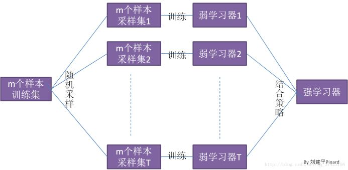
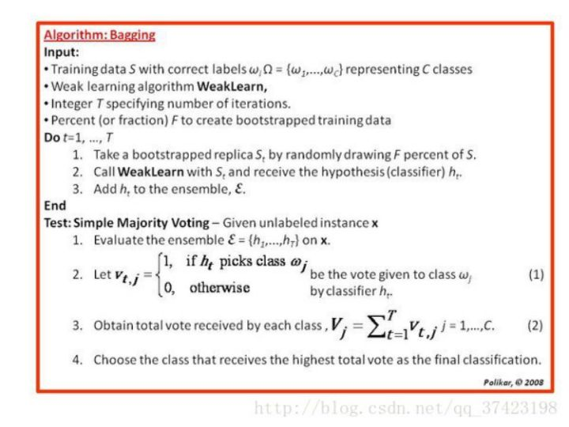

# Bagging分类（BaggingClassifier）使用文档
| 组件名称 |Bagging分类（BaggingClassifier）|  |  |
| --- | --- | --- | --- |
| 工具集 | 机器学习 |  |  |
| 组件作者 | 雪浪云-墨文 |  |  |
| 文档版本 | 1.0 |  |  |
| 功能 |Bagging分类（BaggingClassifier）算法|  |  |
| 镜像名称 | ml_components:3 |  |  |
| 开发语言 | Python |  |  |

## 组件原理
### 1.概念

是一种在原始数据集上通过有放回抽样重新选出S个新数据集来训练分类器的集成技术。也就是说这些新数据集是允许重复的。

使用训练出来的分类器集合来对新样本进行分类，然后用多数投票或者对输出求均值的方法统计所有分类器的分类结果，结果最高的类别即为最终标签。为了提高模型的方差(variance, 差异性)，bagging在训练待组合的各个模型的时候是从训练集合中随机的抽取数据。比如随机森林(random forest)就是多个随机决策树平均组合起来以达到较优分类准确率的模型。

### 2.算法原理及实现

Bagging的弱学习器之间没有Boosting那样的联系。它的特点在“随机采样”。

随机采样(bootsrap)就是从我们的训练集里面采集固定个数的样本，但是每采集一个样本后，都将样本放回。也就是说，之前采集到的样本在放回后有可能继续被采集到。

注意到这和GBDT的子采样是不同的。GBDT的子采样是无放回采样，而Bagging的子采样是有放回采样。

对于一个样本，它在某一次含m个样本的训练集的随机采样中，每次被采集到的概率是1m。不被采集到的概率为1−1m。如果m次采样都没有被采集中的概率是(1−1m)m。当m→∞时，(1−1m)m→1e≃0.368。也就是说，在bagging的每轮随机采样中，训练集中大约有36.8%的数据没有被采样集采集中。

对于这部分大约36.8%的没有被采样到的数据，我们常常称之为袋外数据(Out Of Bag, 简称OOB)。这些数据没有参与训练集模型的拟合，因此可以用来检测模型的泛化能力。

### 3.算法流程

输入为样本集D={(x1,y1),(x2,y2),...(xm,ym)}，弱学习器算法, 弱分类器迭代次数T。

输出为最终的强分类器f(x)

1）对于t=1,2…,T:

a)对训练集进行第t次随机采样，共采集m次，得到包含m个样本的采样集Dm

b)用采样集Dm训练第m个弱学习器Gm(x)

2. 如果是分类算法预测，则T个弱学习器投出最多票数的类别或者类别之一为最终类别。如果是回归算法，T个弱学习器得到的回归结果进行算术平均得到的值为最终的模型输出。

## 输入桩
支持单个csv文件输入。
### 输入端子1

- **端口名称**：训练数据
- **输入类型**：Csv文件
- **功能描述**： 输入用于训练的数据
## 输出桩
支持sklearn模型输出。
### 输出端子1

- **端口名称**：输出模型
- **输出类型**：sklearn模型
- **功能描述**： 输出训练好的模型用于预测
## 参数配置
### n_estimators

- **功能描述**：集合中的base模型数。
- **必选参数**：是
- **默认值**：10
### max_samples 

- **功能描述**：要从X中抽取样本数来训练每个base模型。如果为整数，则抽取max_samples 个样本。如果为浮点数，则抽取max_samples * X.shape[0] 个样本。
- **必选参数**：是
- **默认值**：1.0
### max_features

- **功能描述**：要从X中抽取样本数来训练每个base模型。如果为整数，则抽取max_features 个特征。如果为浮点数，则抽取max_features * X.shape[1] 个特征。
- **必选参数**：是
- **默认值**：1.0
### bootstrap

- **功能描述**：样品是否用有放回的抽取。如果为假，则执行不放回的采样。
- **必选参数**：是
- **默认值**：True
### bootstrap_features 

- **功能描述**：是否用采用有放回的方式抽取特征。
- **必选参数**：是
- **默认值**：false
### oob_score

- **功能描述**：是否使用袋外样本来估计泛化误差。
- **必选参数**：是
- **默认值**：false
### warm_start

- **功能描述**：当设置为True时，重复使用先前调用的解决方案来拟合并向集合添加更多的估计器，否则，只需拟合一个全新的集合。
- **必选参数**：是
- **默认值**：false
### n_jobs

- **功能描述**：并行数
- **必选参数**：否
- **默认值**：（无）
### random_state

- **功能描述**：随机种子
- **必选参数**：否
- **默认值**：（无）
### verbose 

- **功能描述**：控制拟合和预测时的详细程度。
- **必选参数**：否
- **默认值**：（无）
### 需要训练

- **功能描述**：该模型是否需要训练，默认为需要训练。
- **必选参数**：是
- **默认值**：true
### 特征字段

- **功能描述**：特征字段
- **必选参数**：是
- **默认值**：（无）
### 识别字段

- **功能描述**：识别字段
- **必选参数**：是
- **默认值**：（无）
## 使用方法
- 将组件拖入到项目中
- 与前一个组件输出的端口连接（必须是csv类型）
- 点击运行该节点

