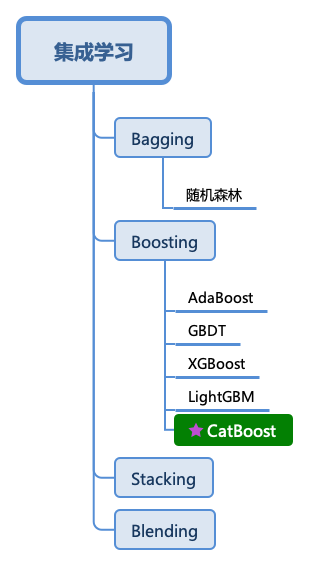

# CatBoost多分类使用文档
| 组件名称 | CatBoost多分类|  |  |
| --- | --- | --- | --- |
| 工具集 | 机器学习 |  |  |
| 组件作者 | 雪浪云-墨文 |  |  |
| 文档版本 | 1.0 |  |  |
| 功能 | CatBoost多分类算法|  |  |
| 镜像名称 | ml_components:3 |  |  |
| 开发语言 | Python |  |  |

## 组件原理
CatBoost是俄罗斯的搜索巨头Yandex在2017年开源的机器学习库，也是Boosting族算法的一种，同前面介绍过的XGBoost和LightGBM类似，依然是在GBDT算法框架下的一种改进实现，是一种基于对称决策树（oblivious trees）算法的参数少、支持类别型变量和高准确性的GBDT框架，主要说解决的痛点是高效合理地处理类别型特征，这个从它的名字就可以看得出来，CatBoost是由catgorical和boost组成，另外是处理梯度偏差（Gradient bias）以及预测偏移（Prediction shift）问题，提高算法的准确性和泛化能力。

所谓类别型变量（Categorical features）是指其值是离散的集合且相互比较并无意义的变量，比如用户的ID、产品ID、颜色等。因此，这些变量无法在二叉决策树当中直接使用。常规的做法是将这些类别变量通过预处理的方式转化成数值型变量再喂给模型，比如用一个或者若干个数值来代表一个类别型特征。

目前广泛用于低势（一个有限集的元素个数是一个自然数）类别特征的处理方法是One-hot encoding：将原来的特征删除，然后对于每一个类别加一个0/1的用来指示是否含有该类别的数值型特征。One-hot encoding可以在数据预处理时完成，也可以在模型训练的时候完成，从训练时间的角度，后一种方法的实现更为高效，CatBoost对于低势类别特征也是采用后一种实现。

显然，在高势特征当中，比如 user ID，这种编码方式会产生大量新的特征，造成维度灾难。一种折中的办法是可以将类别分组成有限个的群体再进行 One-hot encoding。一种常被使用的方法是根据目标变量统计（Target Statistics，以下简称TS）进行分组，目标变量统计用于估算每个类别的目标变量期望值。甚至有人直接用TS作为一个新的数值型变量来代替原来的类别型变量。重要的是，可以通过对TS数值型特征的阈值设置，基于对数损失、基尼系数或者均方差，得到一个对于训练集而言将类别一分为二的所有可能划分当中最优的那个。在LightGBM当中，类别型特征用每一步梯度提升时的梯度统计（Gradient Statistics，以下简称GS）来表示。
## 输入桩
支持单个csv文件输入。
### 输入端子1

- **端口名称**：训练数据
- **输入类型**：Csv文件
- **功能描述**： 输入用于训练的数据
## 输出桩
支持sklearn模型输出。
### 输出端子1

- **端口名称**：输出模型
- **输出类型**：sklearn模型
- **功能描述**： 输出训练好的模型用于预测
## 参数配置
### 最大树数

- **功能描述**：训练时可以建立的最大树数
- **必选参数**：是
- **默认值**：1000
### 学习率

- **功能描述**：增强学习率
- **必选参数**：是
- **默认值**：0.03
### 最大深度

- **功能描述**：树的最大深度
- **必选参数**：是
- **默认值**：6
### L2正则系数

- **功能描述**：代价函数的L2正则项系数
- **必选参数**：是
- **默认值**：3
### 随机子空间方法

- **功能描述**：随机再次选择特征时，每次节点分裂时选择要使用的特征的百分比
- **必选参数**：是
- **默认值**：1
### 损失函数

- **功能描述**：损失函数
- **必选参数**：是
- **默认值**：Logloss
### Od Wait

- **功能描述**：在得到最佳度量值的后继续训练的迭代次数
- **必选参数**：是
- **默认值**：20
### 过拟合检测器

- **功能描述**：过拟合检测器
- **必选参数**：是
- **默认值**：IncToDec
### Random Seed

- **功能描述**：随机种子
- **必选参数**：是
- **默认值**：0
### Metric Period

- **功能描述**：计算目标和度量值的迭代频率
- **必选参数**：是
- **默认值**：1
### 使用最佳模型

- **功能描述**：使用最佳模型
- **必选参数**：是
- **默认值**：true
### 随机加权法设置

- **功能描述**：定义随机加权法的设置
- **必选参数**：是
- **默认值**：1
### 评估指标

- **功能描述**：评估指标
- **必选参数**：是
- **默认值**：Logloss
### 需要训练

- **功能描述**：该模型是否需要训练，默认为需要训练。
- **必选参数**：是
- **默认值**：true
### 特征字段

- **功能描述**：特征字段
- **必选参数**：是
- **默认值**：（无）
### 识别字段

- **功能描述**：识别字段
- **必选参数**：是
- **默认值**：（无）
## 使用方法
- 将组件拖入到项目中
- 与前一个组件输出的端口连接（必须是csv类型）
- 点击运行该节点

