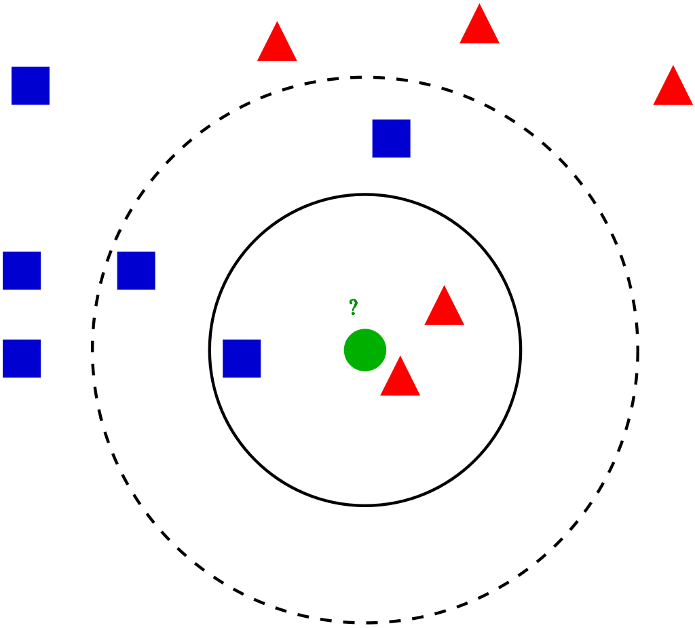
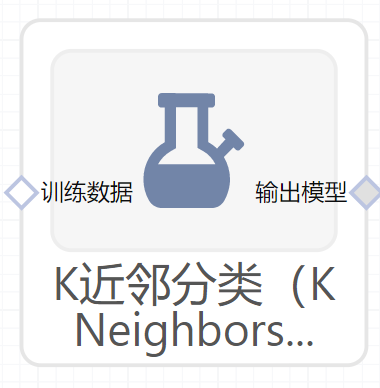

# K近邻分类（KNeighborsClassifier）使用文档
| 组件名称 | K近邻分类（KNeighborsClassifier） |  |  |
| --- | --- | --- | --- |
| 工具集 | 机器学习 |  |  |
| 组件作者 | 雪浪云-墨文 |  |  |
| 文档版本 | 1.0 |  |  |
| 功能 | K近邻分类（KNeighborsClassifier） |  |  |
| 镜像名称 | ml_components:3 |  |  |
| 开发语言 | Python |  |  |

## 组件原理
在模式识别中，k近邻算法(k-NN)是一种用于分类和回归的非参数方法。在这两种情况下，输入由特征空间中k个最近的训练实例组成。输出取决于k-NN是用于分类还是回归：

- 在k-NN分类中，输出是一个类成员。一个对象通过其邻居的多数投票进行分类，对象被分配到k个最近邻居中最常见的类中(k是一个正整数，通常很小)。如果k = 1，那么对象就被简单地分配给那个最近邻居的类。

- 在k-NN回归中，输出是对象的属性值。这个值是k个最近邻值的平均值。

k-NN是一种基于实例的学习，或称为懒惰学习，它只对函数进行局部逼近，所有计算都延迟到分类时。

无论是分类还是回归，有一个有用的技术，可以为临近点的贡献分配权重，这样，距离较近的邻居对平均值的贡献就会大于距离较远的临近点。例如，一个常见的权重方案是给每个邻居一个1/d的权重，其中d是到邻居的距离。

近邻点是从一组对象中提取的，对于这些对象，类别(用于k-NN分类)或对象属性值(用于k-NN回归)是已知的。这可以看作是算法的训练集，尽管不需要显式的训练步骤。

k-NN算法的一个特点是对数据的局部结构敏感。

## 输入桩
支持单个csv文件输入。
### 输入端子1

- **端口名称**：训练数据
- **输入类型**：Csv文件
- **功能描述**： 输入用于训练的数据
## 输出桩
支持sklearn模型输出。
### 输出端子1

- **端口名称**：输出模型
- **输出类型**：sklearn模型
- **功能描述**： 输出训练好的模型用于预测
## 参数配置
### N Neighbors

- **功能描述**：kneighbors默认使用的近邻数量。
- **必选参数**：是
- **默认值**：5
### weights

- **功能描述**：用于预测的权函数。uniform，distance。
- **必选参数**：是
- **默认值**：uniform
### algorithm

- **功能描述**：计算最近邻的算法。‘auto’, ‘ball_tree’, ‘kd_tree’, ‘brute’。
- **必选参数**：是
- **默认值**：auto
### Leaf Size

- **功能描述**：传递给巴利树或KDTree的叶大小。
- **必选参数**：是
- **默认值**：30
### p

- **功能描述**：Minkowski度量的幂参数。
- **必选参数**：是
- **默认值**：2
### metric

- **功能描述**：树的距离度量标准。
- **必选参数**：是
- **默认值**：minkowski
### N Jobs

- **功能描述**：为邻居搜索运行的并行作业数。
- **必选参数**：否
- **默认值**：（无）
### 需要训练

- **功能描述**：该模型是否需要训练，默认为需要训练。
- **必选参数**：是
- **默认值**：true
### 特征字段

- **功能描述：** 特征字段
- **必选参数：** 是
- **默认值：** （无）
### 识别字段

- **功能描述：** 目标字段
- **必选参数：** 是
- **默认值：** （无）
## 使用方法
- 将组件拖入到项目中
- 与前一个组件输出的端口连接（必须是csv类型）
- 点击运行该节点

