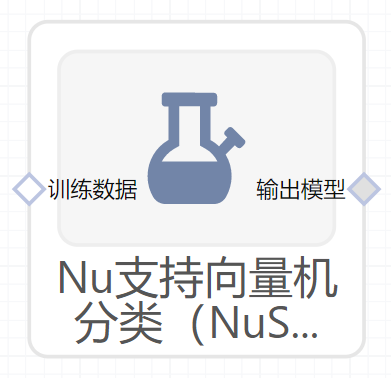

# Nu支持向量机分类（NuSVC）使用文档
| 组件名称 | Nu支持向量机分类（NuSVC） |  |  |
| --- | --- | --- | --- |
| 工具集 | 机器学习 |  |  |
| 组件作者 | 雪浪云-墨文 |  |  |
| 文档版本 | 1.0 |  |  |
| 功能 | Nu支持向量机分类（NuSVC）算法 |  |  |
| 镜像名称 | ml_components:3 |  |  |
| 开发语言 | Python |  |  |

## 组件原理
Nu支持向量机分类是机器学习中的一种分类组件。

在机器学习中，支持向量机(SVMs，也称为支持向量网络)是一种有关联学习算法的监督学习模型，支持分类和回归问题的数据建模。给定一组训练数据，每个样本属于一个或其他类别，用支持向量机算法构建并训练一个模型，将新样本分配到一个类别，使它成为一个非概率性二分类器。支持向量机模型是将样本表示为空间中的点，并将其映射，以便将不同类别的样本之间的间距尽可能大。然后，新的样本被映射到相同的空间中，并根据它们所处的位置，预测它们属于某个类别。

除了执行线性分类，支持向量机还可以通过使用核线方程有效地执行非线性分类，隐式地将它们的输入映射到高维特征空间。

当数据没有标记时，监督学习是不可能的，需要一种无监督学习方法，通过无监督学习试图找到数据到类别的自然聚类，然后将新数据映射到这些形成的类别。支持向量聚类算法是由Hava Siegelmann和Vladimir Vapnik共同创建的，它利用支持向量的统计量对未标注的数据进行分类，是工业应用中应用最广泛的聚类算法之一。

支持向量机分类有两个常用的版本，“epsilon-SVR”和“nu-SVR”。原始的SVM分类公式(SVR)使用参数C [0, inf]和epsilon[0, inf)对没有正确预测的点进行优化，从而产生惩罚。后来开发了两种SVM分类的替代版本，其中惩罚参数epsilon被另一个替代参数nu[0,1]所替代，该替代参数的惩罚略有不同。支持向量机nu版本的主要动机是它有一个更有意义的解释。这是因为nu表示训练样本中误差部分的上界和支持向量部分的下界。有些用户觉得nu比C或更直观。nu-SVM和C-SVM只是惩罚参数的不同版本。这两种情况都解决了相同的优化问题。

## 输入桩
支持单个csv文件输入。
### 输入端子1

- **端口名称**：训练数据
- **输入类型**：Csv文件
- **功能描述**： 输入用于训练的数据
## 输出桩
支持sklearn模型输出。
### 输出端子1

- **端口名称**：输出模型
- **输出类型**：sklearn模型
- **功能描述**： 输出训练好的模型用于预测
## 参数配置
### nu

- **功能描述**：训练误差分数的上界和支持向量分数的下界。
- **必选参数**：是
- **默认值**：0.5
### kernel

- **功能描述**：指定要在算法中使用的内核类型。‘linear’, ‘poly’, ‘rbf’, ‘sigmoid’, ‘precomputed’中的一种。
- **必选参数**：是
- **默认值**：rbf
### degree

- **功能描述**：多项式核函数的次数(' poly ')。
- **必选参数**：是
- **默认值**：3
### grmma

- **功能描述**：' rbf '， ' poly '和' sigmoid '的核系数
- **必选参数**：是
- **默认值**：auto
### coef0

- **功能描述**：核函数中的独立项。
- **必选参数**：是
- **默认值**：0
### shrinking

- **功能描述**：是否使用收缩启发式。
- **必选参数**：是
- **默认值**：true
### tol

- **功能描述**：early stop的容忍度。
- **必选参数**：是
- **默认值**：0.001
### Cache Size

- **功能描述**：指定内核缓存的大小(以MB为单位)。
- **必选参数**：是
- **默认值**：200
### verbose

- **功能描述**：是否输出详细信息。
- **必选参数**：是
- **默认值**：false
### Max Iter

- **功能描述**：要运行的最大迭代数。
- **必选参数**：是
- **默认值**：1000
### Random State

- **功能描述**：随机种子
- **必选参数**：否
- **默认值**：（无）
### Decision Fcuntion Shape 

- **功能描述**：决策函数返回数据形状，‘ovr’或‘ovo’
- **必选参数**：是
- **默认值**：ovr
### 需要训练

- **功能描述**：该模型是否需要训练，默认为需要训练。
- **必选参数**：是
- **默认值**：true
### 特征字段

- **功能描述**：特征字段
- **必选参数**：是
- **默认值**：（无）
### 识别字段

- **功能描述**：识别字段
- **必选参数**：是
- **默认值**：（无）
## 使用方法
- 将组件拖入到项目中
- 与前一个组件输出的端口连接（必须是csv类型）
- 点击运行该节点

