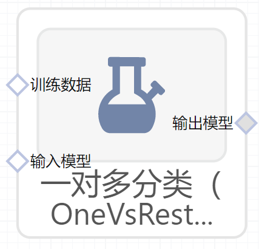

# 一对多分类（OneVsRestClassifier）使用文档
| 组件名称 |一对多分类（OneVsRestClassifier）|  |  |
| --- | --- | --- | --- |
| 工具集 | 机器学习 |  |  |
| 组件作者 | 雪浪云-墨文 |  |  |
| 文档版本 | 1.0 |  |  |
| 功能 | 一对多分类（OneVsRestClassifier）算法|  |  |
| 镜像名称 | ml_components:3 |  |  |
| 开发语言 | Python |  |  |

## 组件原理
SVM算法最初是为二值分类问题设计的，当处理多类问题时，就需要构造合适的多类分类器。构造多分类器可以采用直接法或者间接法。 但是若采取直接法即SVM直接在目标函数上进行修改的话，将多个分类面的参数求解合并到一个最优化问题上，显然难度太大，其计算复杂度比较高，实现起来比较困难，只适合用于小型问题中。

一对多（one-versus-rest,简称OVR SVMs）训练时依次把某个类别的样本归为一类,其他剩余的样本归为另一类，这样k个类别的样本就构造出了k个SVM。分类时将未知样本分类为具有最大分类函数值的那类。

举个例子：假如我有四类要划分（也就是有存在四个Label），他们是A、B、C、D。　于是我在抽取训练集的时候，分别选取四个训练集如下：

- 1.A所对应的向量作为正集，B，C，D所对应的向量作为负集；
- 2.B所对应的向量作为正集，A，C，D所对应的向量作为负集；
- 3.C所对应的向量作为正集，A，B，D所对应的向量作为负集；
- 4.D所对应的向量作为正集，A，B，C所对应的向量作为负集；

{可以概括为 自己一类为正集 其余类为负集，N个类别（N个label）有N个训练集}

使用这四个训练集分别进行训练，然后的得到四个训练结果文件。在测试的时候，把对应的测试向量分别利用这四个训练结果文件进行测试。

最后每个测试都有一个结果f1(x),f2(x),f3(x),f4(x)。

于是最终的结果便是这四个值中最大的一个作为分类结果。
评价：

优点：训练k个分类器，个数较少，其分类速度相对较快。

缺点：

- ①每个分类器的训练都是将全部的样本作为训练样本，这样在求解二次规划问题时，训练速度会随着训练样本的数量的增加而急剧减慢；
- ②同时由于负类样本的数据要远远大于正类样本的数据，从而出现了样本不对称的情况，且这种情况随着训练数据的增加而趋向严重。解决不对称的问题可以引入不同的惩罚因子，对样本点来说较少的正类采用较大的惩罚因子C；
- ③还有就是当有新的类别加进来时，需要对所有的模型进行重新训练。

## 输入桩
支持单个csv文件输入。
### 输入端子1

- **端口名称**：训练数据
- **输入类型**：Csv文件
- **功能描述**： 输入用于训练的数据
### 输入端子2

- **端口名称**：输入模型
- **输入类型**：sklearn模型
- **功能描述**： 分类模型文件
## 输出桩
支持sklearn模型输出。
### 输出端子1

- **端口名称**：输出模型
- **输出类型**：sklearn模型
- **功能描述**： 输出训练好的模型用于预测
## 参数配置
### 并行度

- **功能描述**：训练时的并行度
- **必选参数**：否
- **默认值**：（无）
### 需要训练

- **功能描述**：该模型是否需要训练，默认为需要训练。
- **必选参数**：是
- **默认值**：true
### 特征字段

- **功能描述**：特征字段
- **必选参数**：是
- **默认值**：（无）
### 识别字段

- **功能描述**：识别字段
- **必选参数**：是
- **默认值**：（无）
## 使用方法
- 将组件拖入到项目中
- 与前一个组件输出的端口连接（必须是csv类型）
- 点击运行该节点

