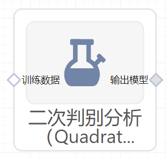

# 二次判别分析（QuadraticDiscriminantAnalysis）使用文档
| 组件名称 | 二次判别分析（QuadraticDiscriminantAnalysis） |  |  |
| --- | --- | --- | --- |
| 工具集 | 机器学习 |  |  |
| 组件作者 | 雪浪云-墨文 |  |  |
| 文档版本 | 1.0 |  |  |
| 功能 | 二次判别分析（QuadraticDiscriminantAnalysis）算法 |  |  |
| 镜像名称 | ml_components:3 |  |  |
| 开发语言 | Python |  |  |

## 组件原理
与线性判别分析类似，二次判别分析是另外一种线性判别分析算法，二者拥有类似的算法特征，区别仅在于：当不同分类样本的协方差矩阵相同时，使用线性判别分析；当不同分类样本的协方差矩阵不同时，则应该使用二次判别。

为了清楚的了解LDA和QDA的应用差异，下图显示了在固定协方差矩阵以及不同协方差矩阵下LDA和QDA的表现差异：

由图中可以看出，在固定协方差矩阵下，LDA和QDA是没有分类结果差异的（上面两张图）；但在不同的协方差矩阵下，LDA和QDA的分类边界明显存在差异，而且LDA已经不能准确的划分数据（下面两张图）。
## 输入桩
支持单个csv文件输入。
### 输入端子1

- **端口名称**：训练数据
- **输入类型**：Csv文件
- **功能描述**： 输入用于训练的数据
## 输出桩
支持sklearn模型输出。
### 输出端子1

- **端口名称**：输出模型
- **输出类型**：sklearn模型
- **功能描述**： 输出训练好的模型用于预测
## 参数配置
### 类别的先验概率

- **功能描述**：类别的先验概率
- **必选参数**：否
- **默认值**：（无）
### 正则化参数

- **功能描述**：模型的正则化参数
- **必选参数**：是
- **默认值**：true
### 奇异值阈值

- **功能描述**：奇异值阈值
- **必选参数**：否
- **默认值**：（无）
### 需要训练

- **功能描述**：该模型是否需要训练，默认为需要训练。
- **必选参数**：是
- **默认值**：true

### 特征字段

- **功能描述：** 特征字段
- **必选参数：** 是
- **默认值：** （无）

### 识别字段

- **功能描述：** 目标字段
- **必选参数：** 是
- **默认值：** （无）
## 使用方法
- 将组件拖入到项目中
- 与前一个组件输出的端口连接（必须是csv类型）
- 点击运行该节点

