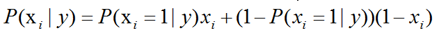
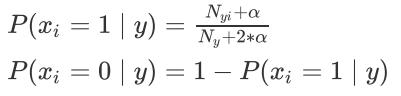
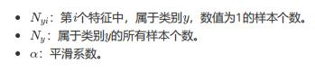

# 伯努利朴素贝叶斯（BernoulliNB）使用文档
| 组件名称 |伯努利朴素贝叶斯（BernoulliNB）|  |  |
| --- | --- | --- | --- |
| 工具集 | 机器学习 |  |  |
| 组件作者 | 雪浪云-墨文 |  |  |
| 文档版本 | 1.0 |  |  |
| 功能 | 伯努利朴素贝叶斯（BernoulliNB）算法|  |  |
| 镜像名称 | ml_components:3 |  |  |
| 开发语言 | Python |  |  |

## 组件原理

在sklearn中，提供了若干种朴素贝叶斯的实现算法，不同的朴素贝叶斯算法，主要是对P(xi|y)的分布假设不同，进而采用不同的参数估计方式。我们能够发现，朴素贝叶斯算法，主要就是计算P(xi|y)，一旦P(xi|y)确定，最终属于每个类别的概率，自然也就迎刃而解了。

设试验E只有两个可能的结果：A与A¯，则称为E为伯努利试验。

伯努利朴素贝叶斯，适用于离散变量，其假设各个特征xi在各个类别y下是服从n重伯努利分布（二项分布）的，因为伯努利试验仅有两个结果，因此，算法会首先对特征值进行二值化处理（假设二值化的结果为1与0）。

计算方式如下：

在训练集中，会进行如下的估计：

因为特征之间的独立性,所以多元伯努利变成各个伯努利分布的连乘积,需要注意的一点是因为是伯努利分布,0-1,特征出现有一个概率p,特征不出现也有一个概率1-p。最终模型的参数估计完成之后,对新样本进行预测时,如果某个特征不出现,需要乘上这个特征不出现的概率,不能只计算特征出现的概率。两个向量直接相乘,并不能得到最终的结果。

## 输入桩
支持单个csv文件输入。
### 输入端子1

- **端口名称**：训练数据
- **输入类型**：Csv文件
- **功能描述**： 输入用于训练的数据
## 输出桩
支持sklearn模型输出。
### 输出端子1

- **端口名称**：输出模型
- **输出类型**：sklearn模型
- **功能描述**： 输出训练好的模型用于预测
## 参数配置
### 平滑参数

- **功能描述**：加性(拉普拉斯/利德斯通)平滑参数，0代表不进行平滑操作
- **必选参数**：是
- **默认值**：1
### 二值化阈值

- **功能描述**：二值化阈值
- **必选参数**：是
- **默认值**：0
### 是否计算类先验概率

- **功能描述**：：是否计算标签列中类的先验概率
- **必选参数**：是
- **默认值**：true
### 类别的先验概率

- **功能描述**：以逗号分隔
- **必选参数**：否
- **默认值**：（无）
### 需要训练

- **功能描述**：该模型是否需要训练，默认为需要训练。
- **必选参数**：是
- **默认值**：true
### 特征字段

- **功能描述**：特征字段
- **必选参数**：是
- **默认值**：（无）
### 识别字段

- **功能描述**：识别字段
- **必选参数**：是
- **默认值**：（无）
## 使用方法
- 将组件拖入到项目中
- 与前一个组件输出的端口连接（必须是csv类型）
- 点击运行该节点

