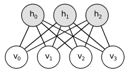

# 伯努利约束玻尔兹曼机分类（BernoulliRBM）使用文档
| 组件名称 | 伯努利约束玻尔兹曼机分类（BernoulliRBM） |  |  |
| --- | --- | --- | --- |
| 工具集 | 机器学习 |  |  |
| 组件作者 | 雪浪云-墨文 |  |  |
| 文档版本 | 1.0 |  |  |
| 功能 | 伯努利约束玻尔兹曼机分类（BernoulliRBM）算法 |  |  |
| 镜像名称 | ml_components:3 |  |  |
| 开发语言 | Python |  |  |

## 组件原理
伯努利约束玻尔兹曼机分类（BernoulliRBM）是机器学习中的一种分类组件。

RBM简化了Boltzmann网络，取消了每层神经元之间的连接，即不再是一个递归神经网络，更像是一个MLP。通常情况下，联合概率分布无法计算，但是可以通过条件概率分布+迭代法近似模拟出符合联合概率的样本。

RBM中采用的是Gibbs采样来重构，是MCMC（Monte Carlo Markov Chain）的一种算法特例。Monte Carlo是根据概率随机生成数据的算法统称，Markov Chain则是符合马尔可夫链的算法统称。

这样，只要通过又臭又长的马尔可夫链，使用Gibbs采样重构出新样本v'就好了。

RBM是一个概率生成模型，而AutoEncoder只是一个普通的模型。神经网络的本质是训练岀能够模拟输入的W，这样，在测试的时候，遇到近似的输入，W能够做出漂亮的响应。RBM选择概率，是因为有概率论的公式支持。这样优化网络，能够达到上述目标。只是原始目标不好优化，Hinton才提出对比训练的方法，即绕了个弯子的选择重构。能量函数使得W朝更大概率方向优化。但是，正如线性回归有最小二乘法和高斯分布两种解释一样。其实，W的训练大可不必拘泥于概率，AutoEncoder则绕过了这点，直接选择了加权重构，所以cost函数简单。可以这么说，重构的数学理论基础就是RBM的原始目标函数。而概率重构启发了直接重构。两者近似等价。从马尔可夫链上看，AutoEncoder可看作是链长为1的特殊形式，即一次重构，而RBM是多次重构。

## 输入桩
支持单个csv文件输入。
### 输入端子1

- **端口名称**：训练数据
- **输入类型**：Csv文件
- **功能描述**： 输入用于训练的数据
## 输出桩
支持sklearn模型输出。
### 输出端子1

- **端口名称**：输出模型
- **输出类型**：sklearn模型
- **功能描述**： 输出训练好的模型用于预测
## 参数配置
### N Component

- **功能描述**：二进制隐藏单元的数量
- **必选参数**：是
- **默认值**：256
### 学习率

- **功能描述**：权重更新的学习率
- **必选参数**：是
- **默认值**：0.1
### 批大小

- **功能描述**：每一批次使用的样本数
- **必选参数**：是
- **默认值**：10
### 迭代次数

- **功能描述**：训练时间内进行的样本迭代次数
- **必选参数**：是
- **默认值**：1000
### Random State

- **功能描述**：随机种子
- **必选参数**：否
- **默认值**：（无）
### 需要训练

- **功能描述**：该模型是否需要训练，默认为需要训练。
- **必选参数**：是
- **默认值**：true
### 特征字段

- **功能描述**：特征字段
- **必选参数**：是
- **默认值**：（无）
### 识别字段

- **功能描述**：识别字段
- **必选参数**：是
- **默认值**：（无）
## 使用方法
- 将组件拖入到项目中
- 与前一个组件输出的端口连接（必须是csv类型）
- 点击运行该节点

