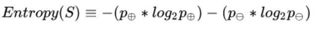
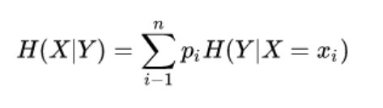

# 决策树分类（DecisionTreeClassifer）使用文档
| 组件名称 | 决策树分类（DecisionTreeClassifer） |  |  |
| --- | --- | --- | --- |
| 工具集 | 机器学习 |  |  |
| 组件作者 | 雪浪云-墨文 |  |  |
| 文档版本 | 1.0 |  |  |
| 功能 | 决策树回归（DecisionTreeRegressor）算法 |  |  |
| 镜像名称 | ml_components:3 |  |  |
| 开发语言 | Python |  |  |

## 组件原理
### 1.什么是决策树
分类决策树模型是一种描述对实例进行分类的树形结构. 决策树由结点和有向边组成. 结点有两种类型: 内部结点和叶节点. 内部节点表示一个特征或属性, 叶节点表示一个类.

决策树(Decision Tree),又称为判定树, 是一种以树结构(包括二叉树和多叉树)形式表达的预测分析模型.

- 通过把实例从根节点排列到某个叶子节点来分类实例
- 叶子节点为实例所属的分类
- 树上每个节点说明了对实例的某个属性的测试, 节点的每个后继分支对应于该属性的一个可能值

### 2.决策树结构

### 3.决策树种类

分类树--对离散变量做决策树

回归树--对连续变量做决策树

### 4.决策树算法

- 有监督的学习
- 非参数学习算法
- 自顶向下递归方式构造决策树
- 在每一步选择中都采取在当前状态下最好/优的选择决策树学习的算法通常是一个递归地选择最优特征, 并根据该特征对训练数据进行分割, 使得各个子数据集有一个最好的分类的过程.在决策树算法中,ID3基于信息增益作为属性选择的度量, C4.5基于信息增益作为属性选择的度量, CART基于基尼指数作为属性选择的度量

### 5.决策树学习过程

- 特征选择
- 决策树生成: 递归结构, 对应于模型的局部最优
- 决策树剪枝: 缩小树结构规模, 缓解过拟合, 对应于模型的全局选择

### 6.决策树优缺点

优点:

(1)速度快: 计算量相对较小, 且容易转化成分类规则. 只要沿着树根向下一直走到叶, 沿途的分裂条件就能够唯一确定一条分类的谓词.

(2)准确性高: 挖掘出来的分类规则准确性高, 便于理解, 决策树可以清晰的显示哪些字段比较重要, 即可以生成可以理解的规则.

(3)可以处理连续和种类字段

(4)不需要任何领域知识和参数假设

(5)适合高维数据

缺点:

(1)对于各类别样本数量不一致的数据, 信息增益偏向于那些更多数值的特征

(2)容易过拟合

(3)忽略属性之间的相关性

### 7.决策树数学知识

若一事假有k种结果, 对应概率为Pi, 则此事件发生后所得到的信息量I为:

给定包含关于某个目标概念的正反样例的样例集S, 那么S相对这个布尔型分类的熵为:

假设随机变量(X,Y), 其联合分布概率为P(X=xi,Y=yi)=Pij, i=1,2,...,n;j=1,2,..,m

则条件熵H(Y|X)表示在已知随机变量X的条件下随机变量Y的不确定性, 其定义为X在给定条件下Y的条件概率分布的熵对X的数学期望

### 8.决策树算法Hunt

在Hunt算法中, 通过递归的方式建立决策树.

- 如果数据集D种所有的数据都属于一个类, 那么将该节点标记为节点.
- 如果数据集D中包含属于多个类的训练数据, 那么选择一个属性将训练数据划分为较小的子集, 对于测试条件的每个输出, 创建一个子节点, 并根据测试结果将D种的记录分布到子节点中, 然后对每一个子节点重复1,2过程, 对子节点的子节点依然是递归地调用该算法, 直至最后停止.

### 9.决策树算法ID3

ID3(Examples,Target_attribute,Attributes)

Examples即训练样例集. Target_attribute是这棵树要预测的目标属性. Attributes是除目标属性外供学习到的决策树测试的属性列表. 返回能正确分类给定Examples的决策树.

- 创建树的Root结点
- 如果Examples都为正, 那么返回label=+的单节点树Root
- 如果Examples都为负, 那么返回label=-的单节点树Root
- 如果Attributes为空, 那么返回单节点树Root, label=Examples中最普通的Target_attribute值
- 否则 A ← Attributes中分类Examples能力最好*的属性

## 输入桩
支持单个csv文件输入。
### 输入端子1

- **端口名称**：训练数据
- **输入类型**：Csv文件
- **功能描述**： 输入用于训练的数据
## 输出桩
支持sklearn模型输出。
### 输出端子1

- **端口名称**：输出模型
- **输出类型**：sklearn模型
- **功能描述**： 输出训练好的模型用于预测
## 参数配置
### Criterion

- **功能描述**：用于测量分割质量的函数。支持标准有“mse“(均方根误差), “friedman_mse”（mean squared error with Friedman’s improvement score for potential splits）, “mae”（平均绝对误差）。
- **必选参数**：是
- **默认值**：mse
### splitter

- **功能描述**：用于在每个节点上选择拆分的策略。支持的策略是“best”选择最佳分割，“random”选择最佳随机分割
- **必选参数**：是
- **默认值**：beat
### 最大深度

- **功能描述**：树的最大深度。如果None，则展开节点，直到所有叶子都是纯的，或者直到所有叶子都包含小于min_samples_split样例
- **必选参数**：否
- **默认值**：（无）
### Min Samples Split

- **功能描述**：分割内部节点所需的最小样本数。最小样本数或最小样本百分比
- **必选参数**：是
- **默认值**：2
### Min Samples Leaf

- **功能描述**：叶节点上所需的最小样本数。任何深度的分歧点只在它在左右分支中留下至少min_samples_leaf训练样本时才会被考虑。这可能有平滑模型的效果，特别是在回归中。
- **必选参数**：是
- **默认值**：1
### Min Weight Fraction Leaf

- **功能描述**：叶节点(所有输入样本)所需权值之和的最小加权分数。当不提供sample_weight时，示例具有相同的权重。
- **必选参数**：是
- **默认值**：0
### Max Features

- **功能描述**：在寻找最佳分割时要考虑的特征数量。数值型时为特征数量，浮点数为特征百分比。“auto”（max_features=n_features），“sqrt”（max_features=sqrt(n_features)），
“log2”（max_features=log2(n_features)）。
- **必选参数**：否
- **默认值**：（无）
### Random State

- **功能描述**：random_state是随机数生成器使用的种子。
- **必选参数**：否
- **默认值**：（无）
### Max Leaf Nodes

- **功能描述**：以最佳优先方式使用max_leaf_nodes生成树。最佳节点定义为杂质的相对减少。如果没有，则无限数量的叶节点。
- **必选参数**：否
- **默认值**：（无）
### Min Impurity Decrease

- **功能描述**：如果分裂导致杂质的减少大于或等于这个值，一个节点就会分裂。
- **必选参数**：是
- **默认值**：0
### presort

- **功能描述**：是否对数据进行预压缩，以加快拟合中最佳分割的发现。
- **必选参数**：是
- **默认值**：0
### 需要训练

- **功能描述**：该模型是否需要训练
- **必选参数**：是
- **默认值**：true

### 特征字段

- **功能描述：** 特征字段
- **必选参数：** 是
- **默认值：** （无）

### 识别字段

- **功能描述：** 目标字段
- **必选参数：** 是
- **默认值：** （无）

## 使用方法
- 将组件拖入到项目中
- 与前一个组件输出的端口连接（必须是csv类型）
- 点击运行该节点

