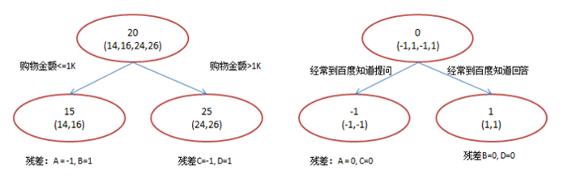
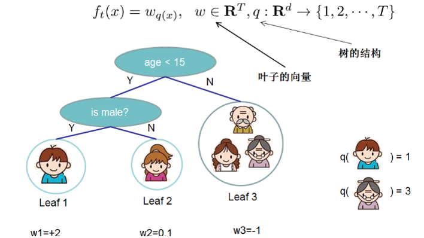
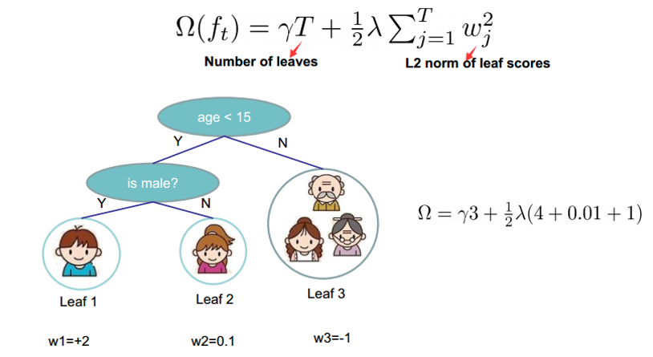
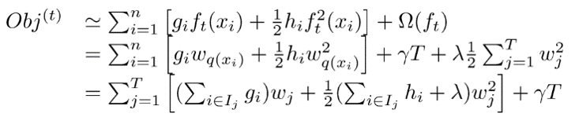
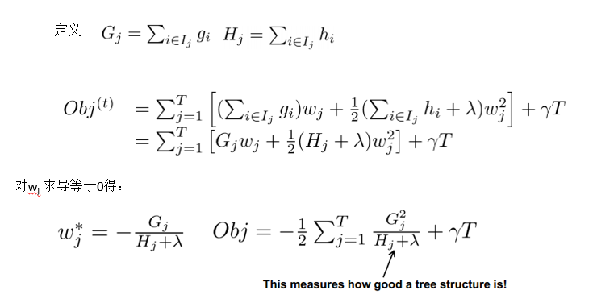
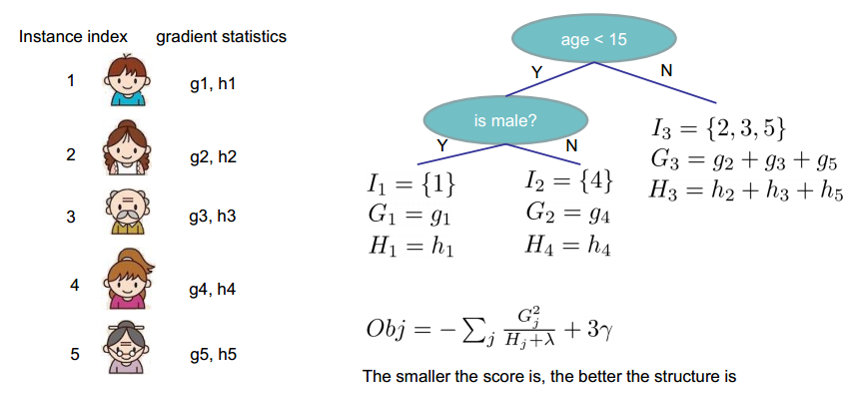
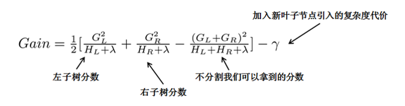
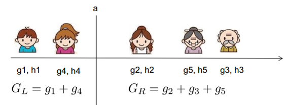
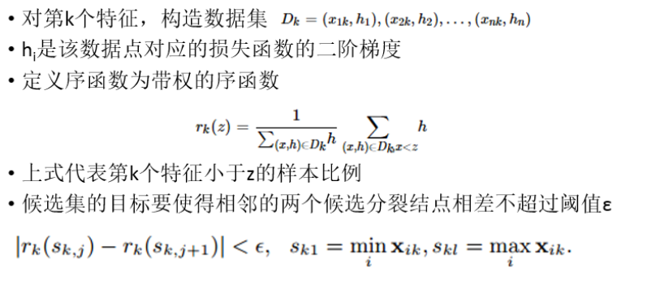

# XGBoost分类（带参数调优）使用文档
| 组件名称 |XGBoost分类（带参数调优）|  |  |
| --- | --- | --- | --- |
| 工具集 | 机器学习 |  |  |
| 组件作者 | 雪浪云-墨文 |  |  |
| 文档版本 | 1.0 |  |  |
| 功能 | XGBoost分类（带参数调优）算法|  |  |
| 镜像名称 | ml_components:3 |  |  |
| 开发语言 | Python |  |  |

## 组件原理
带参数调优给定参数的范围，在某个空间搜索最优参数，并得到最终的训练模型。

### 1. XGBoost是什么

全称：eXtreme Gradient Boosting

作者：陈天奇(华盛顿大学博士)

基础：GBDT

所属：boosting迭代型、树类算法。

适用范围：分类、回归

优点：速度快、效果好、能处理大规模数据、支持多种语言、支 持自定义损失函数等等。

缺点：发布时间短（2014），工业领域应用较少，待检验

### 2. 基础知识 GBDT

xgboost是在GBDT的基础上对boosting算法进行的改进，内部决策树使用的是回归树，简单回顾GBDT如下：

回归树的分裂结点对于平方损失函数，拟合的就是残差；对于一般损失函数（梯度下降），拟合的就是残差的近似值，分裂结点划分时枚举所有特征的值，选取划分点。 最后预测的结果是每棵树的预测结果相加。

### 3. XGBoost算法原理知识

3.1 定义树的复杂度

把树拆分成结构部分q和叶子权重部分w。 树的复杂度函数和样例：

最终的目标函数只依赖于每个数据点的在误差函数上的一阶导数和二阶导数。这么写的原因很明显，由于之前的目标函数求最优解的过程中只对平方损失函数时候方便求，对于其他的损失函数变得很复杂，通过二阶泰勒展开式的变换，这样求解其他损失函数变得可行了。

当定义了分裂候选集合的时候，可以进一步改目标函数。分裂结点的候选响集是很关键的一步，这是xgboost速度快的保证，怎么选出来这个集合，后面会介绍。

Obj代表了当指定一个树的结构的时候，在目标上面最多减少多少。(structure score)

对于每一次尝试去对已有的叶子加入一个分割

这样就可以在建树的过程中动态的选择是否要添加一个结点。

假设要枚举所有x < a 这样的条件，对于某个特定的分割a，要计算a左边和右边的导数和。对于所有的a，我们只要做一遍从左到右的扫描就可以枚举出所有分割的梯度和GL、GR。然后用上面的公式计算每个分割方案的分数就可以了。

- 暴力枚举
- 近似方法 ，近似方法通过特征的分布，按照百分比确定一组候选分裂点，通过遍历所有的候选分裂点来找到最佳分裂点。两种策略：全局策略和局部策略。
- Weighted Quantile Sketch

### 4. XGBoost的改进点总结

- 目标函数通过二阶泰勒展开式做近似
- 定义了树的复杂度，并应用到目标函数中
- 分裂结点处通过结构打分和分割损失动态生长
- 分裂结点的候选集合通过一种分布式Quantile Sketch得到
- 可以处理稀疏、缺失数据 6、可以通过特征的列采样防止过拟合

## 输入桩
支持单个csv文件输入。
### 输入端子1

- **端口名称**：训练数据
- **输入类型**：Csv文件
- **功能描述**： 输入用于训练的数据
## 输出桩
支持sklearn模型输出。
### 输出端子1

- **端口名称**：最佳参数的模型
- **输出类型**：sklearn模型
- **功能描述**： 输出训练好的模型用于预测
## 参数配置
### max_depth

- **功能描述**：树的最大深度.
- **必选参数**：是
- **参数样例**：range(10,100,10)
- **样例含义**：这个参数取10-100之间的数值，间隔为10，最终的取值就是10、20、...、100
### learning_rate增强学习率

- **功能描述**：增强学习率
- **必选参数**：是
- **参数样例**：0，1
- **样例含义**：这个参数从0到1随机取值
### n_estimators

- **功能描述**：树的数量
- **必选参数**：是
- **参数样例**：range(10,100,10)
- **样例含义**：这个参数取10-100之间的数值，间隔为10，最终的取值就是10、20、...、100
### booster 

- **功能描述**：指定要使用的增强器: gbtree, gblinear or dart.
- **必选参数**：是
- **参数样例**：多选
- **样例含义**：这个参数在 gbtree, gblinear ， dart.中选取最优值
### gamma

- **功能描述**：在树的叶节点上进行进一步分区所需的最小损失减少。
- **必选参数**：是
- **参数样例**：0，1
- **样例含义**：这个参数从0到1随机取值
### min_child_weight

- **功能描述**： 子节点所需的最小实例权重总和(hessian).
- **必选参数**：是
- **参数样例**：range(10,100,10)
- **样例含义**：这个参数取10-100之间的数值，间隔为10，最终的取值就是10、20、...、100
### max_delta_step 

- **功能描述**：允许的每棵树权重估计的最大增量步长。
- **必选参数**：是
- **参数样例**：range(10,100,10)
- **样例含义**：这个参数取10-100之间的数值，间隔为10，最终的取值就是10、20、...、100
### subsample

- **功能描述**：训练实例的子样本比率
- **必选参数**：是
- **参数样例**：0，1
- **样例含义**：这个参数从0到1随机取值
### colsample_bytree

- **功能描述**： 构建每棵树时列的子样本比率
- **必选参数**：是 
- **参数样例**：0，1
- **样例含义**：这个参数从0到1随机取值
### colsample_bylevel 

- **功能描述**：每个层级的列的子样本比率。
- **必选参数**：是
- **参数样例**：0，1
- **样例含义**：这个参数从0到1随机取值
### reg_alpha 

- **功能描述**：权重的L1正则项
- **必选参数**：是
- **参数样例**：0，1
- **样例含义**：这个参数从0到1随机取值
### reg_lambda 

- **功能描述**：权重的L2正则项
- **必选参数**：是
- **参数样例**：0，1
- **样例含义**：这个参数从0到1随机取值
### scale_pos_weight

- **功能描述**： 正负权重的平衡。
- **必选参数**：否
- **参数样例**：0，1
- **样例含义**：这个参数从0到1随机取值
### base_score

- **功能描述**：所有实例的初始预测分数，全局偏差.
- **必选参数**：是
- **参数样例**：0，1
- **样例含义**：这个参数从0到1随机取值
### 测试数据比例

- **功能描述**：测试数据比例
- **必选参数**：是
- **默认值**：0.2
### 搜索次数

- **功能描述**：搜索次数
- **必选参数**：是
- **默认值**：100
### 需要训练

- **功能描述**：该模型是否需要训练，默认为需要训练。
- **必选参数**：是
- **默认值**：true
### 特征字段

- **功能描述**：特征字段
- **必选参数**：是
- **默认值**：（无）
### 识别字段

- **功能描述**：识别字段
- **必选参数**：是
- **默认值**：（无）
## 使用方法
- 将组件拖入到项目中
- 与前一个组件输出的端口连接（必须是csv类型）
- 点击运行该节点

