# 逻辑回归（带参数调优）使用文档
| 组件名称 |逻辑回归（带参数调优）|  |  |
| --- | --- | --- | --- |
| 工具集 | 机器学习 |  |  |
| 组件作者 | 雪浪云-墨文 |  |  |
| 文档版本 | 1.0 |  |  |
| 功能 | 逻辑回归（带参数调优）算法|  |  |
| 镜像名称 | ml_components:3 |  |  |
| 开发语言 | Python |  |  |

## 组件原理
带参数调优给定参数的范围，在某个空间搜索最优参数，并得到最终的训练模型。

### 1.什么是逻辑回归

逻辑回归就是这样的一个过程：面对一个回归或者分类问题，建立代价函数，然后通过优化方法迭代求解出最优的模型参数，然后测试验证我们这个求解的模型的好坏。

Logistic回归虽然名字里带“回归”，但是它实际上是一种分类方法，主要用于两分类问题（即输出只有两种，分别代表两个类别）

回归模型中，y是一个定性变量，比如y=0或1，logistic方法主要应用于研究某些事件发生的概率

### 2.逻辑回归的优缺点

优点：

- 速度快，适合二分类问题
- 简单易于理解，直接看到各个特征的权重
- 能容易地更新模型吸收新的数据

缺点：

对数据和场景的适应能力有局限性，不如决策树算法适应性那么强

### 3. 逻辑回归和多重线性回归的区别

Logistic回归与多重线性回归实际上有很多相同之处，最大的区别就在于它们的因变量不同，其他的基本都差不多。正是因为如此，这两种回归可以归于同一个家族，即广义线性模型（generalizedlinear model）。
这一家族中的模型形式基本上都差不多，不同的就是因变量不同。这一家族中的模型形式基本上都差不多，不同的就是因变量不同。

- 如果是连续的，就是多重线性回归
- 如果是二项分布，就是Logistic回归
- 如果是Poisson分布，就是Poisson回归
- 如果是负二项分布，就是负二项回归

### 4. 逻辑回归用途

- 寻找危险因素：寻找某一疾病的危险因素等；
- 预测：根据模型，预测在不同的自变量情况下，发生某病或某种情况的概率有多大；
- 判别：实际上跟预测有些类似，也是根据模型，判断某人属于某病或属于某种情况的概率有多大，也就是看一下这个人有多大的可能性是属于某病。

### 5. Regression 常规步骤

- 寻找h函数（即预测函数）
- 构造J函数（损失函数）
- 想办法使得J函数最小并求得回归参数（θ）

### 6. 构造预测函数h(x)

Logistic函数（或称为Sigmoid函数），函数形式为：

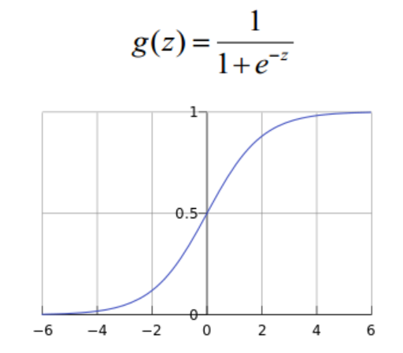

对于线性边界的情况，边界形式如下：

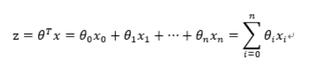

其中，训练数据为向量

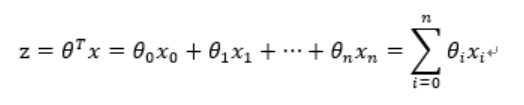

最佳参数

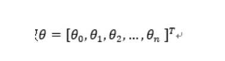

构造预测函数为：

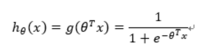

函数h(x)的值有特殊的含义，它表示结果取1的概率，因此对于输入x分类结果为类别1和类别0的概率分别为：

P(y=1│x;θ)=h_θ (x)

P(y=0│x;θ)=1-h_θ (x)

### 构造损失函数J（m个样本，每个样本具有n个特征）

Cost函数和J函数如下，它们是基于最大似然估计推导得到的。

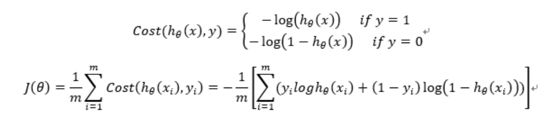

### 8. 损失函数详细推导过程

概率综合起来写成：

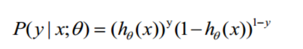

取似然函数为：

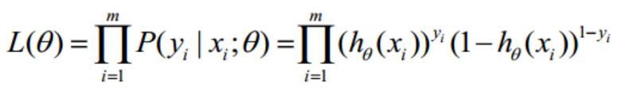

对数似然函数为：

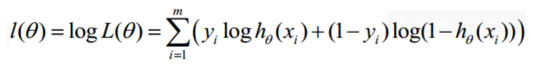

最大似然估计就是求使l(θ)取最大值时的θ，其实这里可以使用梯度上升法求解，求得的θ就是要求的最佳参数。

在Andrew Ng的课程中将J(θ)取为下式，即：

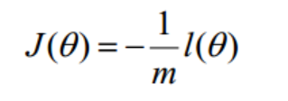

θ更新过程可以写成：

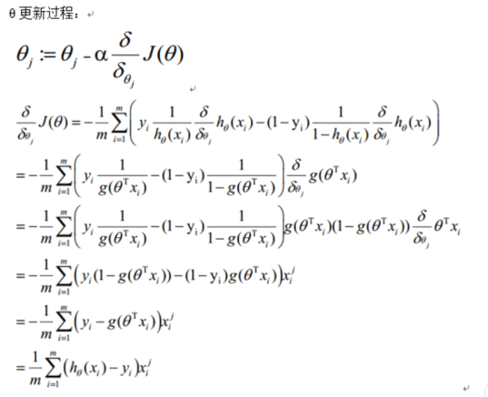

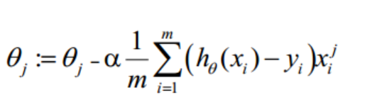

### 9.向量化

vectorization是使用矩阵计算来代替for循环，以简化计算过程，提高效率。

约定训练数据的矩阵形式如下，x的每一行为一条训练样本，而每一列为不同的特称取值：

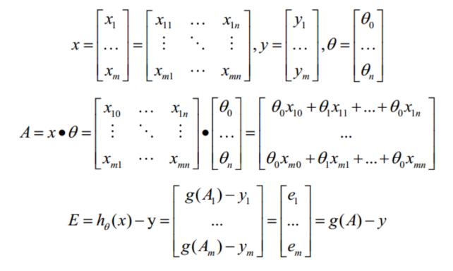

g(A)的参数A为一列向量，所以实现g函数时要支持列向量作为参数，并返回列向量。

θ更新过程可以改为：

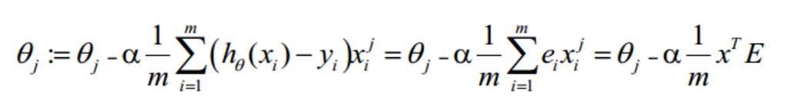

综上所述，Vectorization后θ更新的步骤如下：

1. 求 A=x*θ

2. 求 E=g(A)-y

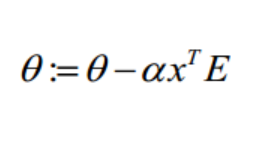

### 10.正则化

过拟合即是过分拟合了训练数据，使得模型的复杂度提高，泛化能力较差（对未知数据的预测能力）

下面左图即为欠拟合，中图为合适的拟合，右图为过拟合。

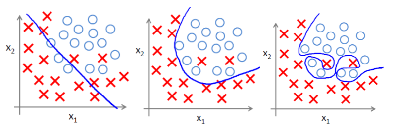

过拟合问题往往源自过多的特征

解决方法

- 可用人工选择要保留的特征
- 模型选择算法
- 保留所有特征，但减少θ的大小

正则化是结构风险最小化策略的实现，是在经验风险上加一个正则化项或惩罚项。正则化项一般是模型复杂度的单调递增函数，模型越复杂，正则化项就越大。

正则项可以取不同的形式，在回归问题中取平方损失，就是参数的L2范数，也可以取L1范数。取平方损失时，模型的损失函数变为：

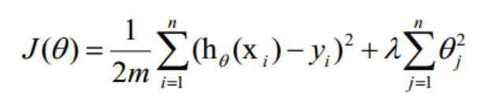

lambda是正则项系数：

- 如果它的值很大，说明对模型的复杂度惩罚大，对拟合数据的损失惩罚小，这样它就不会过分拟合数据，在训练数据上的偏差较大，在未知数据上的方差较小，但是可能出现欠拟合的现象；
- 如果它的值很小，说明比较注重对训练数据的拟合，在训练数据上的偏差会小，但是可能会导致过拟合。

正则化后的梯度下降算法θ的更新变为：

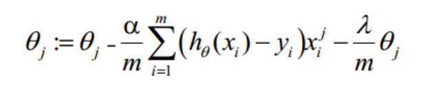
## 输入桩
支持单个csv文件输入。
### 输入端子1

- **端口名称**：训练数据
- **输入类型**：Csv文件
- **功能描述**： 输入用于训练的数据
## 输出桩
支持sklearn模型输出。
### 输出端子1

- **端口名称**：最优参数的模型
- **输出类型**：sklearn模型
- **功能描述**： 输出训练好的模型用于预测
## 参数配置
### tol

- **功能描述**:容忍度
- **必选参数**：是
- **参数样例**：0，1
- **样例含义**：这个参数从0到1随机取值
### C

- **功能描述**：正则化强度的逆
- **必选参数**：是
- **参数样例**：0，10
- **样例含义**：这个参数从0到10随机取值
### intercept_scaling

- **功能描述**：截距缩放
- **必选参数**：否
- **参数样例**：0，10
- **样例含义**：这个参数从0到10随机取值
### class_weight

- **功能描述**：权重
- **必选参数**：是
- **参数样例**：0，1
- **样例含义**：这个参数从0到1随机取值
### 测试数据比例

- **功能描述**：测试数据比例
- **必选参数**：是
- **默认值**：0.2
### 搜索次数

- **功能描述**：搜索次数
- **必选参数**：是
- **默认值**：100
### 需要训练

- **功能描述**：该模型是否需要训练，默认为需要训练。
- **必选参数**：是
- **默认值**：true
### 特征字段

- **功能描述**：特征字段
- **必选参数**：是
- **默认值**：（无）
### 识别字段

- **功能描述**：识别字段
- **必选参数**：是
- **默认值**：（无）
## 使用方法
- 将组件拖入到项目中
- 与前一个组件输出的端口连接（必须是csv类型）
- 点击运行该节点

