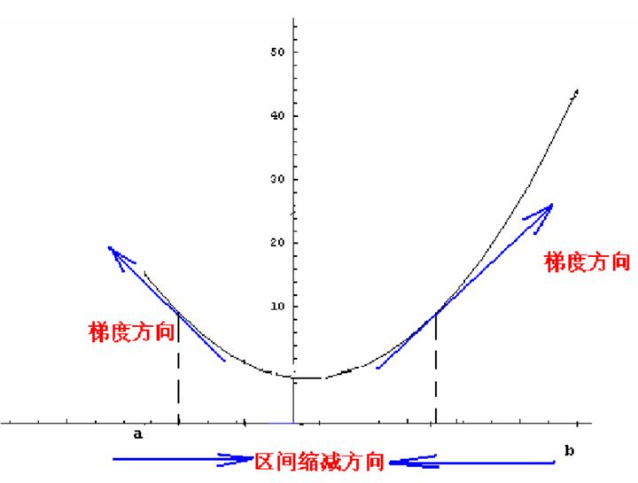
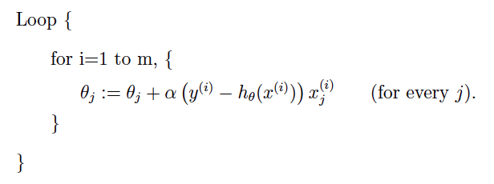
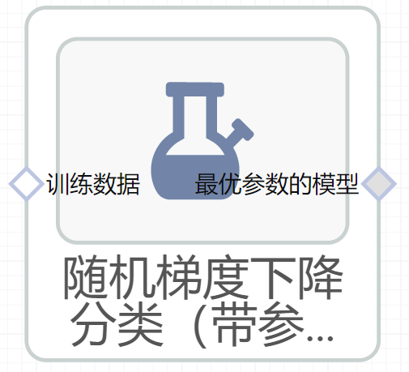

# 随机梯度下降分类（带参数调优）使用文档
| 组件名称 |随机梯度下降分类（带参数调优）|  |  |
| --- | --- | --- | --- |
| 工具集 | 机器学习 |  |  |
| 组件作者 | 雪浪云-墨文 |  |  |
| 文档版本 | 1.0 |  |  |
| 功能 | 随机梯度下降分类（带参数调优）算法|  |  |
| 镜像名称 | ml_components:3 |  |  |
| 开发语言 | Python |  |  |

## 组件原理
带参数调优给定参数的范围，在某个空间搜索最优参数，并得到最终的训练模型。

梯度下降法，是一种基于搜索的最优化方法，最用是最小化一个损失函数。梯度下降是迭代法的一种,可以用于求解最小二乘问题(线性和非线性都可以)。在求解机器学习算法的模型参数，即无约束优化问题时，梯度下降（Gradient Descent）是最常采用的方法之一，另一种常用的方法是最小二乘法。在求解损失函数的最小值时，可以通过梯度下降法来一步步的迭代求解，得到最小化的损失函数和模型参数值。

在直线方程中，导数代表斜率，在曲线方程中，导数代表切线的斜率。导数代表着参数单位变化时，损失函数J相应的的变化。通过上面图中的点可以发现，该点的导数为负值，所以随着参数的增加，损失函数J减小，因此导数从某种意义上还可以代表方向，对应着损失函数J增大的方向。

综上，如果最小化一个函数，我们就需要得到导数再取个负数，并且再乘以一个系数，这个系数通常叫做步长或者叫学习率(Learning rate, Lr)。

随机梯度下降：在每次更新时用1个样本，可以看到多了随机两个字，随机也就是说我们用样本中的一个例子来近似我所有的样本，来调整θ，因而随机梯度下降是会带来一定的问题，因为计算得到的并不是准确的一个梯度，对于最优化问题，凸问题，虽然不是每次迭代得到的损失函数都向着全局最优方向， 但是大的整体的方向是向全局最优解的，最终的结果往往是在全局最优解附近。但是相比于批量梯度，这样的方法更快，更快收敛，虽然不是全局最优，但很多时候是我们可以接受的，所以这个方法用的也比上面的多。下图是其更新公式：

## 输入桩
支持单个csv文件输入。
### 输入端子1

- **端口名称**：训练数据
- **输入类型**：Csv文件
- **功能描述**： 输入用于训练的数据
## 输出桩
支持sklearn模型输出。
### 输出端子1

- **端口名称**：最佳参数的模型
- **输出类型**：sklearn模型
- **功能描述**： 输出训练好的模型用于预测
## 参数配置
### 惩罚函数

- **功能描述**:：正则项
- **必选参数**：是
- **参数样例**：多选
- **样例含义**：这个参数在 none、l1、l2、elasticnet中选取最优值
### alpha

- **功能描述**：用来乘以正则项的常数
- **必选参数**：是
- **参数样例**：0，1
- **样例含义**：这个参数从0到1随机取值
### 最大迭代次数

- **功能描述**：模型训练时的最大迭代次数
- **必选参数**：是
- **参数样例**：range(10,100)
- **样例含义**：这个参数取10-100之间的数值
### 停止标准

- **功能描述**：算法停止的标准
- **必选参数**：是
- **参数样例**：0，1
- **样例含义**：这个参数从0到1随机取值
### epsilon

- **功能描述**：epsilon_insensitive损失函数中的epsilon参数
- **必选参数**：是
- **参数样例**：0，1
- **样例含义**：这个参数从0到1随机取值
### 学习率变化策略

- **功能描述**：求解的精确度
- **必选参数**：是
- **参数样例**：多选
- **样例含义**：这个参数在constant、optimal、invscaling、adaptive中选取最优值
### 初始学习率

- **功能描述**：初始学习率
- **必选参数**：是
- **参数样例**：0，1
- **样例含义**：这个参数从0到1随机取值
### 逆标度学习率的指数

- **功能描述**：逆标度学习率的指数
- **必选参数**：是
- **参数样例**：0，1
- **样例含义**：这个参数从0到1随机取值
### 测试数据比例

- **功能描述**：测试数据比例
- **必选参数**：是
- **默认值**：0.2
### 搜索次数

- **功能描述**：搜索次数
- **必选参数**：是
- **默认值**：100
### 需要训练

- **功能描述**：该模型是否需要训练，默认为需要训练。
- **必选参数**：是
- **默认值**：true
### 特征字段

- **功能描述**：特征字段
- **必选参数**：是
- **默认值**：（无）
### 识别字段

- **功能描述**：识别字段
- **必选参数**：是
- **默认值**：（无）
## 使用方法
- 将组件拖入到项目中
- 与前一个组件输出的端口连接（必须是csv类型）
- 点击运行该节点

