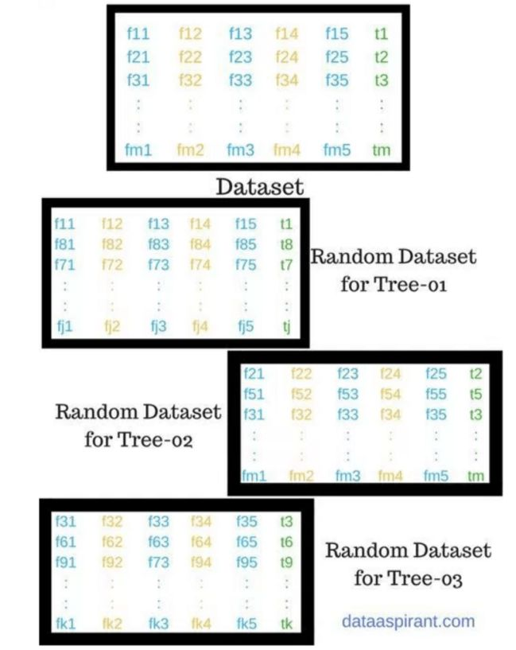

# 随机森林分类（带参数调优）使用文档
| 组件名称 | 随机森林分类（带参数调优） |  |  |
| --- | --- | --- | --- |
| 工具集 | 机器学习 |  |  |
| 组件作者 | 雪浪云-墨文 |  |  |
| 文档版本 | 1.0 |  |  |
| 功能 | 随机森林分类（带参数调优） |  |  |
| 镜像名称 | ml_components:3 |  |  |
| 开发语言 | Python |  |  |

## 组件原理
带参数调优给定参数的范围，在某个空间搜索最优参数，并得到最终的训练模型。

### 1. 什么是随机森林算法
首先，随机森林算法是一种监督式分类算法。我们从名字上也能看出来，它是用来以某种方式创建一个森林，并使其随机。森林中的树的数量直接关系到算法得到的结果：树越多，结果就越准确。但是需要注意一点是，创建森林并不等同于用信息增益或构建索引的方法来创建决策。

熟悉决策树的人在首次接触随机森林时可能会有些困惑。决策树是一种决策辅助工具，它是用一种树状的图形来展示可能的结果。如果你将一个带有目标和特征的训练集输入到决策树里，它就会表示出一些规律出来。这些规律就可以用于执行预测。举个例子，假如你想预测你的女儿是否会喜欢一部动画片，你就可以收集她以前喜欢的动画片，将某些特征作为输入。然后通过决策树算法，你就可以生成相应的规律。而收集这些信息节点和形成规律的过程就是使用信息增益方法和基尼系数计算的过程。

随机森林算法和决策树算法分不同之处就是，在随机森林中，找到根节点和划分特征节点的过程会以随机的方式进行。

### 2. 为何用随机森林算法

我们为何使用随机森林算法主要有四点原因。

- 第一点就是如开头所说，随机森林既可用于分类问题，也可用于回归问题。
- 第二点，过拟合是个非常关键的问题，可能会让模型的结果变得糟糕。但对于随机森林来说，如果森林中的树足够多，那么分类器就不会过拟合模型。
- 第三点是随机森林的分类器可以处理缺失值。
- 最后一点，随机森林分类器可以用分类值建模

### 3. 随机森林算法的现实例子

举出一些例子，以更好的理解随机森林。假设小明想去不同的地方度假两周，向朋友征求意见。朋友会问小明他都去过哪些地方，喜不喜欢这些地方。根据小明的回答，朋友就开始给出建议。这里，小明的朋友用的就是决策树方法。

小明想问问更多朋友的意见，因为他觉得一个朋友的方法没法帮他做出准确的决定。于是其他的朋友们同样问了小明很多随机的问题，然后给出建议。最后，小明把推荐人数最多的那个地方作为度假目的地。我们详细说说这里所举的例子。

其中一位朋友问了小明一些问题，并根据他的回答给出了目的地建议。单从这里看，这是典型的决策树方法。朋友根据小明的回答形成了规律，然后用规律去找到符合规律的答案。

但小明的朋友们同时还以随机的方式问了他很多不同的问题，并给出了建议，也就是对度假目的地的投票。最后，得票率最高的地方就是小明选择的目的地。这里用到的就是典型的随机森林方法。

### 4. 随机森林算法的工作原理

- 从全部“m”个特征中随机选择“K”个特征，其中k << m
- 在“K”个特征中，用最佳分裂点计算节点“d”
- 用最佳分裂将节点分裂为子节点
- 重复前面三步的过程，直到获得“I”个数量的节点。
- 重复第1到第4步“n”次创建“n”个树，从而形成一个森林。

下图展示了随机选择特征的过程：

在第二阶段，根据上一阶段创建的随机森林分类器，我们会做出预测。过程如下：

- 选取测试特征，用每个随机创建的决策树的规律去预测结果，并保存预测的结果（目标）。
- 结算每个预测目标的得票数。
- 将得票最多的预测目标作为随机森林算法的最终预测。

### 5. 随机森林的应用案例

在这部分我们列举随机森林算法在4个领域的应用案例：银行、医疗、股市和电子商务。

- 在银行领域，随机森林算法可用于发现忠诚客户，也就是说客户经常从银行借贷并且按时还款，同样也能用于发现欺诈客户，即那些没有按时还款且行为异常的人。
- 在医疗领域，随机森林算法能够用于识别医药中的不同成分是否以正确的方式组合在以前，也可通过分析患者的病历识别疾病。
- 在股市方面，随机森林算法可以用于识别股票的波动行为，预估损失或收益。
- 在电子商务方面，随机森林算法可用于根据顾客的购物经历，预测他们是否喜欢系统推荐的商品。

### 6. 随机森林的优点

和其它分类方法相比，随机森林算法有三个优势：

- 在分类问题的应用方面，随机森林算法可以避免过拟合问题。
- 对于分类任务和回归任务，可以使用同一个随机森林算法。
- 随机森林算法能够用于从训练数据集中识别出最重要的特征，即特征工程

## 输入桩
支持单个csv文件输入。
### 输入端子1

- **端口名称**：训练数据
- **输入类型**：Csv文件
- **功能描述**： 输入用于训练的数据
## 输出桩
支持sklearn模型输出。
### 输出端子1

- **端口名称**：最佳参数的模型
- **输出类型**：sklearn模型
- **功能描述**： 输出训练好的模型用于预测
## 参数配置
### N Estimators

- **功能描述**：森林中的树的个数。
- **必选参数**：是
- **参数样例**：range(10,50,5)
- **样例含义**：这个参数取10-50之间的数值，间隔为5，最终的取值就是10、15、...、50
### criterion

- **功能描述**：用于测量分割质量的函数。支持的标准是均值平方误差的“mse”和均值绝对误差的“mae”。
- **必选参数**：是
- **参数样例**：多选
- **样例含义**：这个参数在 mse，mae中选取最优值
### Max Depth

- **功能描述**：树的最大深度
- **必选参数**：是
- **参数样例**：range(10,100,5)
- **样例含义**：这个参数取10-100之间的数值，间隔为5，最终的取值就是10、15、...、100
### Min Weight Fraction Leaf

- **功能描述**：叶节点(所有输入样本)所需权值之和的最小加权分数。
- **必选参数**：是
- **参数样例**：0，1
- **样例含义**：这个参数从0到1随机取值
### Max Features

- **功能描述**：在寻找最佳分割时要考虑的特征数量。“auto”，“sqrt”，“log2”。
- **必选参数**：是
- **默认值**：auto
### Min Impurity Decrease

- **功能描述**：如果分裂导致杂质的减少大于或等于这个值，一个节点就会分裂。
- **必选参数**：是
- **参数样例**：多选
- **样例含义**：这个参数在 “auto”，“sqrt”，“log2”中选取最优值
### 测试数据比例

- **功能描述**：测试数据比例
- **必选参数**：是
- **默认值**：0.2
### 搜索次数

- **功能描述**：搜索次数
- **必选参数**：是
- **默认值**：100
### 需要训练

- **功能描述**：该模型是否需要训练，默认为需要训练。
- **必选参数**：是
- **默认值**：true

### 特征字段

- **功能描述：** 特征字段
- **必选参数：** 是
- **默认值：** （无）

### 识别字段

- **功能描述：** 目标字段
- **必选参数：** 是
- **默认值：** （无）
## 使用方法
- 将组件拖入到项目中
- 与前一个组件输出的端口连接（必须是csv类型）
- 点击运行该节点

