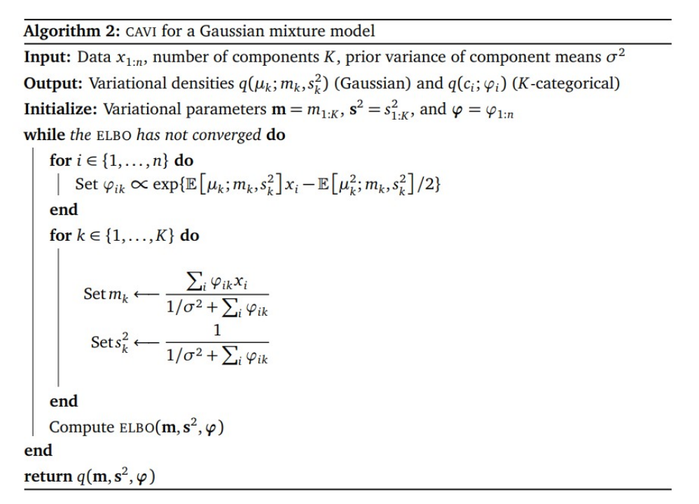

# 变分贝叶斯高斯混合（BayesianGaussianMixture）使用文档
| 组件名称 |变分贝叶斯高斯混合（BayesianGaussianMixture）|  |  |
| --- | --- | --- | --- |
| 工具集 | 机器学习 |  |  |
| 组件作者 | 雪浪云-墨文 |  |  |
| 文档版本 | 1.0 |  |  |
| 功能 | 变分贝叶斯高斯混合（BayesianGaussianMixture）算法|  |  |
| 镜像名称 | ml_components:3 |  |  |
| 开发语言 | Python |  |  |

## 组件原理
变分贝叶斯方法最早由Matthew J.Beal在他的博士论文《Variational Algorithms for Approximate Bayesian Inference》中提出，作者将其应用于隐马尔科夫模型，混合因子分析，非线性动力学，图模型等。变分贝叶斯是一类用于贝叶斯估计和机器学习领域中近似计算复杂（intractable）积分的技术。它主要应用于复杂的统计模型中，这种模型一般包括三类变量：观测变量(observed variables, data)，未知参数（parameters）和潜变量（latent variables）。在贝叶斯推断中，参数和潜变量统称为不可观测变量(unobserved variables)。变分贝叶斯方法主要是两个目的:

- 近似不可观测变量的后验概率，以便通过这些变量作出统计推断。
- 对一个特定的模型，给出观测变量的边缘似然函数（或称为证据，evidence）的下界。主要用于模型的选择，认为模型的边缘似然值越高，则模型对数据拟合程度越好，该模型产生Data的概率也越高。

对于第一个目的，蒙特卡洛模拟，特别是用Gibbs取样的MCMC方法，可以近似计算复杂的后验分布，能很好地应用到贝叶斯统计推断。此方法通过大量的样本估计真实的后验，因而近似结果带有一定的随机性。与此不同的是，变分贝叶斯方法提供一种局部最优，但具有确定解的近似后验方法。

从某种角度看，变分贝叶斯可以看做是EM算法的扩展，因为它也是采用极大后验估计(MAP)，即用单个最有可能的参数值来代替完全贝叶斯估计。另外，变分贝叶斯也通过一组相互依然（mutually dependent）的等式进行不断的迭代来获得最优解。

## 输入桩
支持单个csv文件输入。
### 输入端子1

- **端口名称**：训练数据
- **输入类型**：Csv文件
- **功能描述**： 输入用于训练的数据
### 输入端子2

- **端口名称**：用户提供的协方差分布的先验数据
- **输入类型**：npy文件
- **功能描述**： 输入提供的协方差分布的先验数据据，可以不连
## 输出桩
支持sklearn模型输出。
### 输出端子1

- **端口名称**：输出模型
- **输出类型**：sklearn模型
- **功能描述**： 输出训练好的模型用于预测
## 参数配置
### N Component

- **功能描述**：混合成分的数量
- **必选参数**：是
- **默认值**：1
### 协方差类型

- **功能描述**：协方差类型
- **必选参数**：是
- **默认值**：full
### 收敛阈值

- **功能描述**：收敛阈值
- **必选参数**：是
- **默认值**：0.001
### 非负正则化参数

- **功能描述**：添加到协方差对角线的非负正则化
- **必选参数**：是
- **默认值**：0.000001
### 最大迭代次数

- **功能描述**：训练时执行的最大迭代次数
- **必选参数**：是
- **默认值**：100
### 初始化次数

- **功能描述**：要执行的初始化次数
- **必选参数**：是
- **默认值**：1
### 初始化方法

- **功能描述**：初始化方法
- **必选参数**：是
- **默认值**：kmeans
### 权重浓度先验类型

- **功能描述**：权重浓度先验类型
- **必选参数**：是
- **默认值**：dirichlet_process
### 权重浓度先验

- **功能描述**：权重分布上各组的狄利克雷浓度
- **必选参数**：否
- **默认值**：（无）
### 平均分布精度先验

- **功能描述**：平均分布精度先验
- **必选参数**：否
- **默认值**：（无）
### 平均分布先验

- **功能描述**：平均分布先验
- **必选参数**：否
- **默认值**：（无）
### 自由度先验

- **功能描述**：自由度先验
- **必选参数**：否
- **默认值**：（无）
### Random State

- **功能描述**：随机种子
- **必选参数**：否
- **默认值**：（无）
### 需要训练

- **功能描述**：该模型是否需要训练，默认为需要训练。
- **必选参数**：是
- **默认值**：true
### 特征字段

- **功能描述**：特征字段
- **必选参数**：是
- **默认值**：（无）
### 识别字段

- **功能描述**：识别字段
- **必选参数**：是
- **默认值**：（无）
## 使用方法
- 将组件拖入到项目中
- 与前一个组件输出的端口连接（必须是csv类型）
- 点击运行该节点

