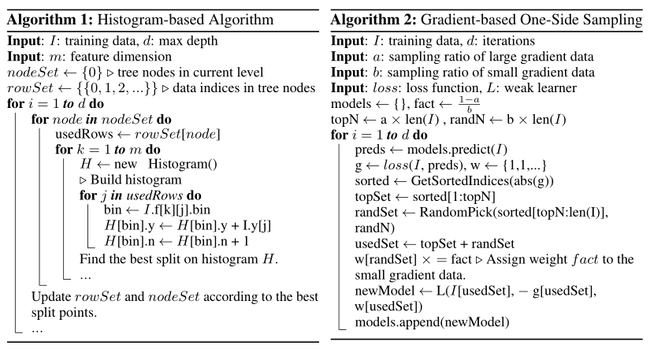

# 基于直方图的梯度提升决策树分类（HistGradientBoostingClassifier）使用文档
| 组件名称 | 基于直方图的梯度提升决策树分类（HistGradientBoostingClassifier） |  |  |
| --- | --- | --- | --- |
| 工具集 | 机器学习 |  |  |
| 组件作者 | 雪浪云-墨文 |  |  |
| 文档版本 | 1.0 |  |  |
| 功能 | 基于直方图的梯度提升决策树分类（HistGradientBoostingClassifier）|  |  |
| 镜像名称 | ml_components:3 |  |  |
| 开发语言 | Python |  |  |

## 组件原理
GBDT是一种集成模型的决策树，顺序训练决策树。每次迭代中，GBDT通过拟合负梯度（残差）来学到决策树。

学习决策树是GBDT主要的时间花销，而学习决策树中找到最优切分点最消耗时间。广泛采用的预排序算法来找到最优切分点，这种方法会列举预排序中所有可能的切分点。这种算法虽然能够找到最优的切分点，但对于训练速度和内存消耗上都效率低。另一种流行算法是直方图算法（histogram-based algorithm）。直方图算法并不通过特征排序找到最优的切分点，而是将连续的特征值抽象成离散的分箱，并使用这些分箱在训练过程中构建特征直方图，这种算法更加训练速度和内存消耗上都更加高效，lightGBM使用此种算法。

histogram-based算法通过直方图寻找最优切分点，其建直方图消耗O(#data  #feature)，寻找最优切分点消耗O(#bin  # feature)，而#bin的数量远小于#data，所以建直方图为主要时间消耗。如果能够减少数据量或特征量，那么还能够够加速GBDT的训练。

为了减少训练数据集，通常做法是下采样。例如过滤掉权重小于阈值的数据。SGB每次迭代中用随机子集训练弱学习器。或者采样率基于训练过程动态调整。除了基于AdaBoost的SGB不能直接应用于GBDT，因为GBDT中没有原始的权重。虽然SGB也能间接应用于GBDT，单往往会影响精度。

同样，过滤掉弱特征（什么是弱特征）来减少特征量。通常用主成分分析或者投影法。当然，这些方法依赖于一个假设-特征包含高度的冗余，但实际中往往不是。（设计特征来自于其独特的贡献，移除任何一维度都可以某种程度上影响精度）。

实际中大规模的数据集通常都是非常稀疏的，使用预排序算法的GBDT能够通过无视为0的特征来降低训练时间消耗。然后直方图算法没有优化稀疏的方案。因为直方图算法无论特征值是否为0，都需要为每个数据检索特征区间值。如果基于直方图的GBDT能够有效利用稀疏特征将是最优。

下图是两个算法的对比：

## 输入桩
支持单个csv文件输入。
### 输入端子1

- **端口名称**：训练数据
- **输入类型**：Csv文件
- **功能描述**： 输入用于训练的数据
## 输出桩
支持sklearn模型输出。
### 输出端子1

- **端口名称**：输出模型
- **输出类型**：sklearn模型
- **功能描述**： 输出训练好的模型用于预测
## 参数配置
### loss

- **功能描述**：在boosting过程中使用的损失函数。
- **必选参数**：是
- **默认值**：ls
### Learning Rate

- **功能描述**：学习率
- **必选参数**：是
- **默认值**：0.1
### Max Iter

- **功能描述**:boosting过程的最大迭代次数
- **必选参数**：是
- **默认值**：100
### Max Leaf Nodes

- **功能描述**:每棵树的最大叶子数。
- **必选参数**：是
- **默认值**：31
### Max Depth

- **功能描述**：单个回归器的最大深度。
- **必选参数**：是
- **默认值**：（无）
### Min Samples Leaf

- **功能描述**:每片叶子的最小样本数。
- **必选参数**：是
- **默认值**：20
### L2 Regularization

- **功能描述**:L2正则化参数。
- **必选参数**：是
- **默认值**：0
### Max Bins

- **功能描述**:使用的最大bin数。
- **必选参数**：是
- **默认值**：255
### scoring

- **功能描述**：用于early stop的计分参数。
- **必选参数**：否
- **默认值**：（无）
### Validation Fraction

- **功能描述**：预留用于验证的训练数据的比例，用于提前停止训练。
- **必选参数**：是
- **默认值**：0.1
### N Iter No Change

- **功能描述**:用来决定什么时候“early stop”。
- **必选参数**：否
- **默认值**：（无）
### tol

- **功能描述**：early stop的容忍度。
- **必选参数**：是
- **默认值**：1e-7
### verbose

- **功能描述**:是否打印一些关于拟合过程的信息。
- **必选参数**：是
- **默认值**：0
### Random State

- **功能描述**:随机种子。
- **必选参数**：否
- **默认值**：（无）
### 需要训练

- **功能描述**：该模型是否需要训练，默认为需要训练。
- **必选参数**：是
- **默认值**：true

### 特征字段

- **功能描述：** 特征字段
- **必选参数：** 是
- **默认值：** （无）

### 识别字段

- **功能描述：** 目标字段
- **必选参数：** 是
- **默认值：** （无）
## 使用方法
- 将组件拖入到项目中
- 与前一个组件输出的端口连接（必须是csv类型）
- 点击运行该节点

