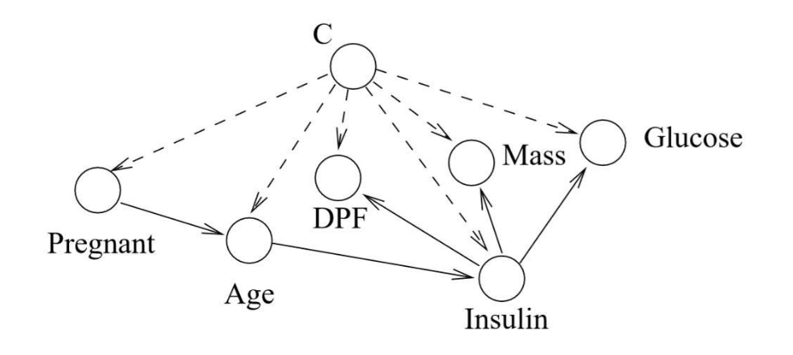

# 增强朴素贝叶斯（ComplementNB）使用文档
| 组件名称 |增强朴素贝叶斯（ComplementNB）|  |  |
| --- | --- | --- | --- |
| 工具集 | 机器学习 |  |  |
| 组件作者 | 雪浪云-墨文 |  |  |
| 文档版本 | 1.0 |  |  |
| 功能 | 增强朴素贝叶斯（ComplementNB）算法|  |  |
| 镜像名称 | ml_components:3 |  |  |
| 开发语言 | Python |  |  |

## 组件原理
贝叶斯网络(Bayesian network)，又称信念网络(Belief Network)，或有向无环图模(directed acyclic graphical model)，是一种概率图模型。贝叶斯网络中的有向无环图的节点表示随机变量，父节点表示条件，子节点表示结果。两个节点间的箭头连接对应一个概率值。而朴素贝叶斯网络模型作为贝叶斯网络的一个特殊表示，认为子节点对应的属性都是相互独立的，其网络图如下所示，其中A1，A2等表示C的各个属性：

增强朴素贝叶斯网络作为朴素贝叶斯网络的改进模型，假设属性对应的各个节点之间不一定相互独立的。图中的虚线表示的是朴素贝叶斯分类器，实线表示的是相关属性之间的关联。

增强朴素贝叶斯网络中，在Z已知的情况下，Y可以提供给X的信息（如上图中的C提供给Age的信息），这里用互信息表示，如下所示：

相比较于朴素贝叶斯而言，TAN保持了计算的复杂度和鲁棒性，但是有更好的准确率。可应用于医疗诊断等。
## 输入桩
支持单个csv文件输入。
### 输入端子1

- **端口名称**：训练数据
- **输入类型**：Csv文件
- **功能描述**： 输入用于训练的数据
## 输出桩
支持sklearn模型输出。
### 输出端子1

- **端口名称**：输出模型
- **输出类型**：sklearn模型
- **功能描述**： 输出训练好的模型用于预测
## 参数配置
### 平滑参数

- **功能描述**：加性(拉普拉斯/利德斯通)平滑参数，0代表不进行平滑操作
- **必选参数**：是
- **默认值**：1
### 计算先验概率

- **功能描述**：是否计算训练数据中，标签列中类的先验概率
- **必选参数**：是
- **默认值**：true
### 类别的先验概率

- **功能描述**：以逗号分隔
- **必选参数**：否
- **默认值**：（无）
### 是否进行权重二次归一化

- **功能描述**：是否对已经计算出来的权重，进行第二次归一化操作
- **必选参数**：是
- **默认值**：false
### 需要训练

- **功能描述**：该模型是否需要训练，默认为需要训练。
- **必选参数**：是
- **默认值**：true
### 特征字段

- **功能描述**：特征字段
- **必选参数**：是
- **默认值**：（无）
### 识别字段

- **功能描述**：识别字段
- **必选参数**：是
- **默认值**：（无）
## 使用方法
- 将组件拖入到项目中
- 与前一个组件输出的端口连接（必须是csv类型）
- 点击运行该节点

