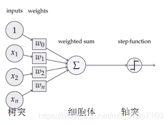
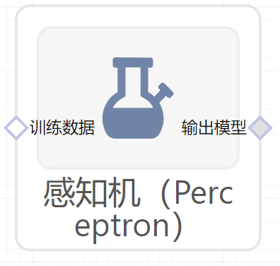

# 感知机（Perceptron）使用文档
| 组件名称 |感知机（Perceptron）|  |  |
| --- | --- | --- | --- |
| 工具集 | 机器学习 |  |  |
| 组件作者 | 雪浪云-墨文 |  |  |
| 文档版本 | 1.0 |  |  |
| 功能 | 感知机（Perceptron）算法|  |  |
| 镜像名称 | ml_components:3 |  |  |
| 开发语言 | Python |  |  |

## 组件原理
感知机是1957年，由Rosenblatt提出会，是神经网络和支持向量机的基础。

感知机是有生物学上的一个启发，他的参照对象和理论依据可以参照下图：（我们的大脑可以认为是一个神经网络，是一个生物的神经网络，在这个生物的神经网络里边呢，他的最小单元我们可以认为是一个神经元，一个neuron，这些很多个神经元连接起来形成一个错综复杂的网络，我们把它称之为神经网络。当然我们现在所说的，在深度学习包括机器学习指的神经网络Neural Networks实际上指的是人工神经网络Artificial Neural Networks，简写为ANNs。我们只是简化了。我们人的神经网络是由这样一些神经元来构成的，那么这个神经元他的一些工作机制呢就是通过这样一个下面图的结构，首先接收到一些信号，这些信号通过这些树突(dendrite)组织，树突组织接收到这些信号送到细胞里边的细胞核(nucleus)，这些细胞核对接收到的这些信号，这些信号是以什么形式存在的呢？这些信号比如说眼睛接收到的光学啊，或者耳朵接收到的声音信号，到树突的时候会产生一些微弱的生物电，那么就形成这样的一些刺激，那么在细胞核里边对这些收集到的接收到的刺激进行综合的处理，当他的信号达到了一定的阈值之后，那么他就会被激活，就会产生一个刺激的输出，那么就会形成一个我们大脑接收到的进一步的信号，那么他是通过轴突这样的输出计算的，这就是我们人脑的一个神经元进行感知的时候大致的一个工作原理。）

为了模拟或者说机器或者算法来实现这样一个过程呢，那么感知机就构建了一个类似的结构。通过下图可以看到：

## 输入桩
支持单个csv文件输入。
### 输入端子1

- **端口名称**：训练数据
- **输入类型**：Csv文件
- **功能描述**： 输入用于训练的数据
## 输出桩
支持sklearn模型输出。
### 输出端子1

- **端口名称**：输出模型
- **输出类型**：sklearn模型
- **功能描述**： 输出训练好的模型用于预测
## 参数配置
### 惩罚函数

- **功能描述**：惩罚函数
- **必选参数**：是
- **默认值**：penalty
### alpha

- **功能描述**:：乘以正则化项的常数
- **必选参数**：是
- **默认值**：0.0001
### 计算截距

- **功能描述**:：是否计算截距
- **必选参数**：是
- **默认值**：true
### 最大迭代次数

- **功能描述**：模型训练时的最大迭代次数
- **必选参数**：是
- **默认值**：1000
### 停止容忍度

- **功能描述**：停止容忍度
- **必选参数**：是
- **默认值**：0.001
### eta0

- **功能描述**：：更新权重时乘以的常数
- **必选参数**：是
- **默认值**：1
### 早停

- **功能描述**：当验证分数没有提高时，是否使用提前停止来终止训练
- **必选参数**：是
- **默认值**：false
### 验证集比例

- **功能描述**：训练集中用作验证集数据的比例
- **必选参数**：是
- **默认值**：0.1
### 验证得分不变的最大次数

- **功能描述**：在提前停止之前验证机得分没有提高的迭代次数
- **必选参数**：是
- **默认值**：5
### 并行度

- **功能描述**：训练时使用的CPU核数
- **必选参数**：否
- **默认值**：（无）
### Random State

- **功能描述**：随机种子
- **必选参数**：否
- **默认值**：（无）
### 需要训练

- **功能描述**：该模型是否需要训练，默认为需要训练。
- **必选参数**：是
- **默认值**：true
### 特征字段

- **功能描述**：特征字段
- **必选参数**：是
- **默认值**：（无）
### 识别字段

- **功能描述**：识别字段
- **必选参数**：是
- **默认值**：（无）
## 使用方法
- 将组件拖入到项目中
- 与前一个组件输出的端口连接（必须是csv类型）
- 点击运行该节点

