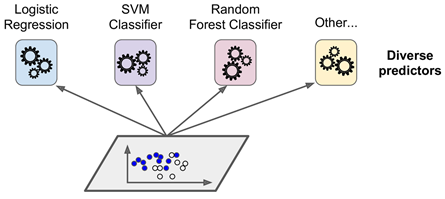
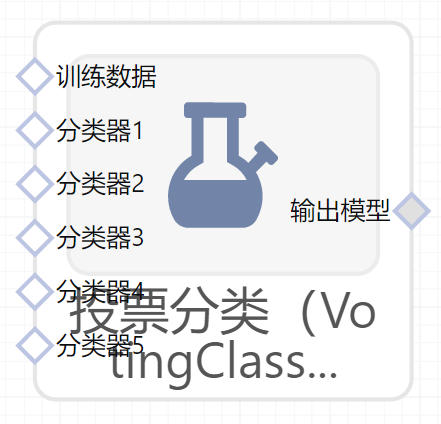

# 投票分类（VotingClassifier）使用文档
| 组件名称 |投票分类（VotingClassifier）|  |  |
| --- | --- | --- | --- |
| 工具集 | 机器学习 |  |  |
| 组件作者 | 雪浪云-墨文 |  |  |
| 文档版本 | 1.0 |  |  |
| 功能 | 投票分类（VotingClassifier）算法|  |  |
| 镜像名称 | ml_components:3 |  |  |
| 开发语言 | Python |  |  |

## 组件原理
假设我们现在提出了一个复杂的问题，并抛给几千个随机的人，然后汇总他们的回答。在很多情况下，我们可以看到这种汇总后的答案会比一个专家的答案要更好。这个称为“群众的智慧”。同理，如果我们汇总一组的预测器（例如分类器与回归器）的预测结果，我们可以经常获取到比最优的单个预测器要更好的预测结果。这一组预测器称为一个集成，所以这种技术称为集成学习，一个集成学习算法称为一个集成方法。

举一个集成方法的例子，我们可以训练一组决策树分类器，每个都在训练集的一组不同的随机子集上进行训练。在做决策时，我们可以获取所有单个决策树的预测结果，然后根据各个结果对每个类别的投票数，最多票的类别获胜。这种集成决策树称为随机森林。尽管它非常简单，不过它是当前最强大的机器学习算法之一。

我们之前在机器学习项目流程里介绍过，我们一般会在接近项目末尾的时候使用集成方法。在我们已经有了几个非常好的预测器之后，要尝试将它们组合，可能会形成一个更好的预测器。实际上，在机器学习比赛中，获胜的解决方案一般都引入了好几个集成方法。

假设我们训练了几个分类器，每个都能达到80%以上的准确率。

一个非常简单，但是能创建一个更好的分类器的办法是：聚合每个分类器预测的类别，然后选其中投票最多的类别。如下图所示，这种多数投票分类器称为一个硬投票（hard voting）分类器。

令人出乎意料的是，这种投票分类器经常可以比单个最优分类器的准确度要更高。而且，即使每个分类器都是一个弱学习者（weak learner，也就是说它的预测能力仅比随机猜稍微高一点），集成的结果仍可以是一个强学习者（strong learner，能达到高准确率）。

类似，假设我们构造了一个集成，包含1000个分类器，这些分类器每个单独的正确率仅有51%。如果我们使用投票最多的类别作为预测结果，我们可能能获取75%的准确率。这就好比1000个分类器中，“面朝上更多“的概率。不过这个成立的条件在于：所有的分类器都是完全独立的，它们产生的错误也都是不相关的。这种情况很明显在机器学习中不是这么回事，因为它们都是在同一个数据集上进行的训练。它们更有可能产生同样类型的错误，所以也会有很多票投给错误的类别，并最终降低了集成的准确率。

集成学习在预测器互相之间（尽可能地）独立时表现最好。其中一个办法就是使用完全不同的算法训练不同的分类器。这个可以增加它们产生不同类型错误的几率，提升集成的准确度。

## 输入桩
支持单个csv文件输入。
### 输入端子1

- **端口名称**：训练数据
- **输入类型**：Csv文件
- **功能描述**： 输入用于训练的数据
### 输入端子2

- **端口名称**：分类模型1
- **输入类型**：sklearn模型
- **功能描述**： 输入用于分类的模型1
### 输入端子3

- **端口名称**：分类模型2
- **输入类型**：sklearn模型
- **功能描述**： 输入用于分类的模型2
### 输入端子4

- **端口名称**：分类模型3
- **输入类型**：sklearn模型
- **功能描述**： 输入用于分类的模型3
### 输入端子5

- **端口名称**：分类模型4
- **输入类型**：sklearn模型
- **功能描述**： 输入用于分类的模型4
### 输入端子6

- **端口名称**：分类模型5
- **输入类型**：sklearn模型
- **功能描述**： 输入用于分类的模型5
## 输出桩
支持sklearn模型输出。
### 输出端子1

- **端口名称**：输出模型
- **输出类型**：sklearn模型
- **功能描述**： 输出训练好的模型用于预测
## 参数配置
### 投票方式

- **功能描述**：选择投票方式
- **必选参数**：是
- **默认值**：hard
### 权重

- **功能描述**：权重序列
- **必选参数**：是
- **默认值**：hard
### 并行度

- **功能描述**：训练时的并行度
- **必选参数**：否
- **默认值**：（无）
### 扁平变换

- **功能描述**：仅在投票方式= "soft"时影响变换输出的形状
- **必选参数**：否
- **默认值**：（无）
### 需要训练

- **功能描述**：该模型是否需要训练，默认为需要训练。
- **必选参数**：是
- **默认值**：true
### 特征字段

- **功能描述**：特征字段
- **必选参数**：是
- **默认值**：（无）
### 识别字段

- **功能描述**：识别字段
- **必选参数**：是
- **默认值**：（无）
## 使用方法
- 将组件拖入到项目中
- 与前一个组件输出的端口连接（必须是csv类型）
- 点击运行该节点

