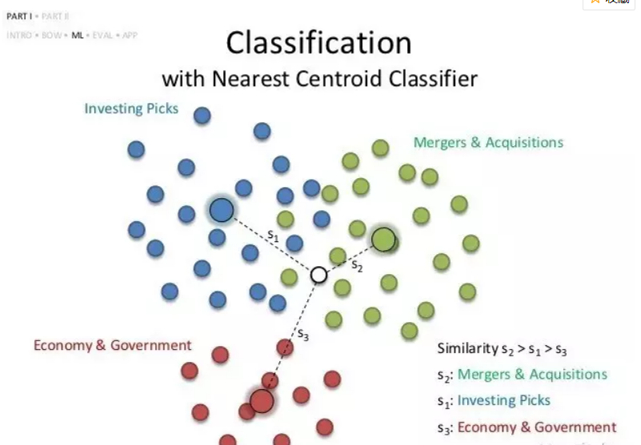

# 最近质心分类（NearestCentroid）使用文档
| 组件名称 | 最近质心分类（NearestCentroid）|  |  |
| --- | --- | --- | --- |
| 工具集 | 机器学习 |  |  |
| 组件作者 | 雪浪云-墨文 |  |  |
| 文档版本 | 1.0 |  |  |
| 功能 |最近质心分类（NearestCentroid）算法|  |  |
| 镜像名称 | ml_components:3 |  |  |
| 开发语言 | Python |  |  |

## 组件原理
最近质心(NC)分类器是机器学习中最被低估和未充分利用的分类器之一。但是，它非常强大，对于某些机器学习分类任务非常有效。Nearest Centroid分类器有点类似于K-Nearest Neighbors 分类器。

机器学习中一个经常被忽视的原则是根据简单但有意义的数据构建简单的算法，可以有效地完成特定任务，而不是使用复杂的模型。这也称为统计中的充分性原则。最近质心分类器可以说是机器学习中最简单的分类算法。Nearest Centroid分类器的工作原理很简单:给定一个数据点(观察)，Nearest Centroid分类器简单地为其分配均值或质心最接近它的训练样本的标签(类别)。

当应用于文本分类时，最近质心分类器也称为Rochhio分类器。Python的scikit-learn库提供了一个简单的函数来实现最沂的质心分类器。

基本上，最近质心分类器的作用可以通过三个步骤来解释:
- 在训练时计算每个目标类的质心。
- 训练后，给定任何一点，说“X”。计算点X和每个类的质心之间的距离。
- 在所有计算的距离中，选择最小距离。给定点距离最小的质心，它的类被分配给给定点。

## 输入桩
支持单个csv文件输入。
### 输入端子1

- **端口名称**：训练数据
- **输入类型**：Csv文件
- **功能描述**： 输入用于训练的数据
## 输出桩
支持sklearn模型输出。
### 输出端子1

- **端口名称**：输出模型
- **输出类型**：sklearn模型
- **功能描述**： 输出训练好的模型用于预测
## 参数配置
### 计算距离方法

- **功能描述**：计算距离方法
- **必选参数**：是
- **默认值**：500
### 缩小阈值

- **功能描述**：：缩小质心以移除特征的阈值
- **必选参数**：是
- **默认值**：euclidean
### 需要训练

- **功能描述**：该模型是否需要训练，默认为需要训练。
- **必选参数**：是
- **默认值**：true
### 特征字段

- **功能描述**：特征字段
- **必选参数**：是
- **默认值**：（无）
### 识别字段

- **功能描述**：识别字段
- **必选参数**：是
- **默认值**：（无）
## 使用方法
- 将组件拖入到项目中
- 与前一个组件输出的端口连接（必须是csv类型）
- 点击运行该节点

