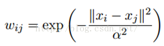
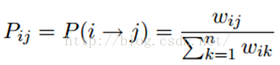
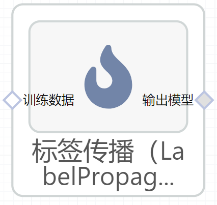

# 标签传播（LabelPropagation）使用文档
| 组件名称 |标签传播（LabelPropagation）|  |  |
| --- | --- | --- | --- |
| 工具集 | 机器学习 |  |  |
| 组件作者 | 雪浪云-墨文 |  |  |
| 文档版本 | 1.0 |  |  |
| 功能 | 标签传播（LabelPropagation）算法|  |  |
| 镜像名称 | ml_components:3 |  |  |
| 开发语言 | Python |  |  |

## 组件原理
半监督学习(Semi-Supervised Learning，SSL)是模式识别和机器学习领域研究的重点问题，是监督学习与无监督学习相结合的一种学习方法。半监督学习使用大量的未标记数据，以及同时使用标记数据，来进行模式识别工作。当使用半监督学习时，将会要求尽量少的人员来从事工作，同时，又能够带来比较高的准确性，因此，半监督学习正越来越受到人们的重视。

LP算法是基于Graph的，因此我们需要先构建一个图。我们为所有的数据构建一个图，图的节点就是一个数据点，包含labeled和unlabeled的数据。节点i和节点j的边表示他们的相似度。这个图的构建方法有很多，这里我们假设这个图是全连接的，节点i和节点j的边权重为：

这里，α是超参。

还有个非常常用的图构建方法是knn图，也就是只保留每个节点的k近邻权重，其他的为0，也就是不存在边，因此是稀疏的相似矩阵。

标签传播算法非常简单：通过节点之间的边传播label。边的权重越大，表示两个节点越相似，那么label越容易传播过去。我们定义一个NxN的概率转移矩阵P：

Pij表示从节点i转移到节点j的概率。假设有C个类和L个labeled样本，我们定义一个LxC的label矩阵YL，第i行表示第i个样本的标签指示向量，即如果第i个样本的类别是j，那么该行的第j个元素为1，其他为0。同样，我们也给U个unlabeled样本一个UxC的label矩阵YU。把他们合并，我们得到一个NxC的soft label矩阵F=[YL;YU]。soft label的意思是，我们保留样本i属于每个类别的概率，而不是互斥性的，这个样本以概率1只属于一个类。当然了，最后确定这个样本i的类别的时候，是取max也就是概率最大的那个类作为它的类别的。那F里面有个YU，它一开始是不知道的，那最开始的值是多少？无所谓，随便设置一个值就可以了。

## 输入桩
支持单个csv文件输入。
### 输入端子1

- **端口名称**：训练数据
- **输入类型**：Csv文件
- **功能描述**： 输入用于训练的数据
### 输入端子2

- **端口名称**：用户提供的初始均值数据
- **输入类型**：npy文件
- **功能描述**： 输入提供的初始均值数据，可以不连
### 输入端子3

- **端口名称**：用户提供的初始精度数据即协方差矩阵的倒数
- **输入类型**：npy文件
- **功能描述**： 输入提供的初始精度数据即协方差矩阵的倒数，可以不连
## 输出桩
支持sklearn模型输出。
### 输出端子1

- **端口名称**：输出模型
- **输出类型**：sklearn模型
- **功能描述**： 输出训练好的模型用于预测
## 参数配置
### 核函数

- **功能描述**：核函数
- **必选参数**：是
- **默认值**：rbf
### gamma

- **功能描述**：rbf核函数参数
- **必选参数**：是
- **默认值**：20
### 近邻数

- **功能描述**：knn核函数参数
- **必选参数**：是
- **默认值**：7
### 最大迭代次数

- **功能描述**：允许的最大迭代次数
- **必选参数**：是
- **默认值**：30
### 收敛阈值

- **功能描述**：收敛阈值
- **必选参数**：是
- **默认值**：0.001
### 并行度

- **功能描述**：训练时的并行度
- **必选参数**：否
- **默认值**：（无）
### 用于填充空值的值

- **功能描述**：用于填充空值的值
- **必选参数**：否
- **默认值**：（无）
### 需要训练

- **功能描述**：该模型是否需要训练，默认为需要训练。
- **必选参数**：是
- **默认值**：true
### 特征字段

- **功能描述**：特征字段
- **必选参数**：是
- **默认值**：（无）
### 识别字段

- **功能描述**：识别字段
- **必选参数**：是
- **默认值**：（无）
## 使用方法
- 将组件拖入到项目中
- 与前一个组件输出的端口连接（必须是csv类型）
- 点击运行该节点

