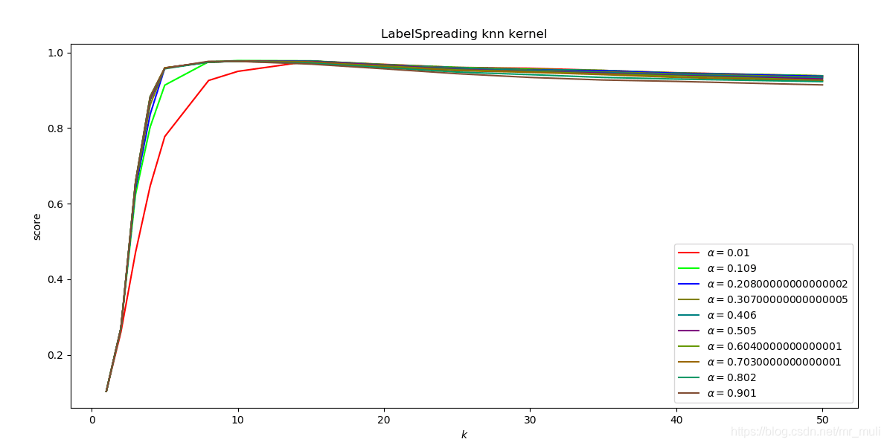
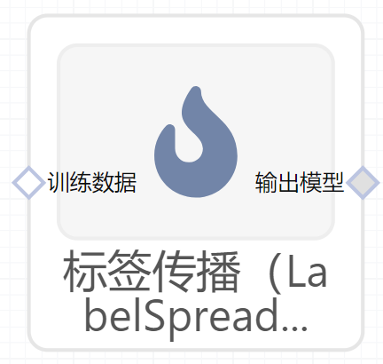

# 标签传播（LabelSpreading）使用文档
| 组件名称 |标签传播（LabelSpreading）|  |  |
| --- | --- | --- | --- |
| 工具集 | 机器学习 |  |  |
| 组件作者 | 雪浪云-墨文 |  |  |
| 文档版本 | 1.0 |  |  |
| 功能 | 标签传播（LabelSpreading）算法|  |  |
| 镜像名称 | ml_components:3 |  |  |
| 开发语言 | Python |  |  |

## 组件原理
半监督学习(Semi-Supervised Learning，SSL)是模式识别和机器学习领域研究的重点问题，是监督学习与无监督学习相结合的一种学习方法。半监督学习使用大量的未标记数据，以及同时使用标记数据，来进行模式识别工作。当使用半监督学习时，将会要求尽量少的人员来从事工作，同时，又能够带来比较高的准确性，因此，半监督学习正越来越受到人们的重视。

该模型与基本的标签传播算法Propagation相似，但采用基于归一化图Laplacian的亲和矩阵和跨标签的软夹紧算法。

## 输入桩
支持单个csv文件输入。
### 输入端子1

- **端口名称**：训练数据
- **输入类型**：Csv文件
- **功能描述**： 输入用于训练的数据
### 输入端子2

- **端口名称**：用户提供的初始均值数据
- **输入类型**：npy文件
- **功能描述**： 输入提供的初始均值数据，可以不连
### 输入端子3

- **端口名称**：用户提供的初始精度数据即协方差矩阵的倒数
- **输入类型**：npy文件
- **功能描述**： 输入提供的初始精度数据即协方差矩阵的倒数，可以不连
## 输出桩
支持sklearn模型输出。
### 输出端子1

- **端口名称**：输出模型
- **输出类型**：sklearn模型
- **功能描述**： 输出训练好的模型用于预测
## 参数配置
### 核函数

- **功能描述**：核函数
- **必选参数**：是
- **默认值**：rbf
### gamma

- **功能描述**：rbf核函数参数
- **必选参数**：是
- **默认值**：20
### 近邻数

- **功能描述**：knn核函数参数
- **必选参数**：是
- **默认值**：7
### 夹紧系数

- **功能描述**：0到1中的一个值，它指定一个实例相对于其初始标签而言，应该采用其邻居的信息的相对数量
- **必选参数**：是
- **默认值**：0.2
### 最大迭代次数

- **功能描述**：允许的最大迭代次数
- **必选参数**：是
- **默认值**：30
### 收敛阈值

- **功能描述**：收敛阈值
- **必选参数**：是
- **默认值**：0.001
### 并行度

- **功能描述**：训练时的并行度
- **必选参数**：否
- **默认值**：（无）
### 用于填充空值的值

- **功能描述**：用于填充空值的值
- **必选参数**：否
- **默认值**：（无）
### 需要训练

- **功能描述**：该模型是否需要训练，默认为需要训练。
- **必选参数**：是
- **默认值**：true
### 特征字段

- **功能描述**：特征字段
- **必选参数**：是
- **默认值**：（无）
### 识别字段

- **功能描述**：识别字段
- **必选参数**：是
- **默认值**：（无）
## 使用方法
- 将组件拖入到项目中
- 与前一个组件输出的端口连接（必须是csv类型）
- 点击运行该节点

