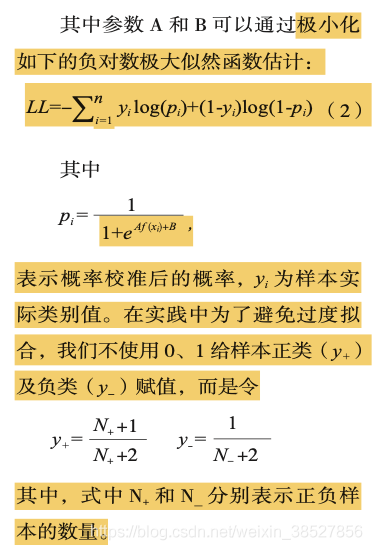
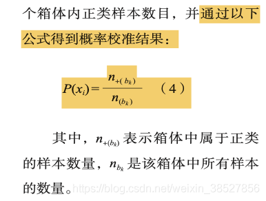

# 概率校准分类（CalibratedClassifierCV）使用文档
| 组件名称 |概率校准分类（CalibratedClassifierCV）|  |  |
| --- | --- | --- | --- |
| 工具集 | 机器学习 |  |  |
| 组件作者 | 雪浪云-墨文 |  |  |
| 文档版本 | 1.0 |  |  |
| 功能 | 概率校准分类（CalibratedClassifierCV）算法|  |  |
| 镜像名称 | ml_components:3 |  |  |
| 开发语言 | Python |  |  |

## 组件原理
### 1.背景
对于某个不确定问题，每个人都会给出一个判断即主观概率，事物实际发生的概率是客观概率，概率校准是衡量主观概率与客观概率之间一致程度的方法，如果一个人的主观概率判断经常比客观概率大，则过份自信，相反就是过低自信。朴素贝叶斯是过分自信的分类器，支持向量机是过低自信的分类器，逻辑回归往往能给出较好的概率预测。

分类器分类的结果即score,而非probability，是由于分类器给出的概率结果与真实的概率分布差别较大。

分类模型得到类别概率结果有2条解决路径：

- 1 直接建立概率分类模型，如使用logistic回归、朴素贝叶斯、随机森林等输出预测的概率结果，从而依据结果判定类别，如结果大于0.5则为正样本等；

- 2 通过对分类结果进行再学习得到概率，即概率校准。

### 2.概率校准的作用：

- 1 将非概率分类模型的输出转化为概率；

- 2 对概率分类模型的结果进行进一步修正。
### 3.实现概率校准的方法：

1.参数方法：Platt Scaling(sigmoid),将分类模型的输出结果通过Sigmoid函数转化为概率，即校准后的概率

Isotonic回归：找到一个能够拟合数据点的单调递增函数，同时最小化均方误差，即一分类器输出的每个样本的概率值作为自变量，以样本的真实值作为因变量，来拟合单调递增函数；在测试时，先根据分类器给出原始概率，然后使用拟合出来的函数计算校准后的概率

2.非参数方法：Histogram Binning,对所有未知样本x根据分类模型原始输出得分进行排序，然后将其分成若干等频箱体，再计算每个箱体内正样本数目

## 输入桩
支持单个csv文件输入。
### 输入端子1

- **端口名称**：训练数据
- **输入类型**：Csv文件
- **功能描述**： 输入用于训练的数据
### 输入端子2

- **端口名称**：输入模型
- **输入类型**：sklearn模型
- **功能描述**： 分类模型文件
### 输入端子3

- **端口名称**：交叉模型
- **输入类型**：sklearn模型
- **功能描述**： 用于交叉验证的模型
## 输出桩
支持sklearn模型输出。
### 输出端子1

- **端口名称**：输出模型
- **输出类型**：sklearn模型
- **功能描述**： 输出训练好的模型用于预测
## 参数配置
### 校准方法

- **功能描述**：校准方法
- **必选参数**：是
- **默认值**：sigmoid
### 输入模型是否已经训练

- **功能描述**：若已经训练，则所有的数据都用于校准
- **必选参数**：是
- **默认值**：true
### 需要训练

- **功能描述**：该模型是否需要训练，默认为需要训练。
- **必选参数**：是
- **默认值**：true
### 特征字段

- **功能描述**：特征字段
- **必选参数**：是
- **默认值**：（无）
### 识别字段

- **功能描述**：识别字段
- **必选参数**：是
- **默认值**：（无）
## 使用方法
- 将组件拖入到项目中
- 与前一个组件输出的端口连接（必须是csv类型）
- 点击运行该节点

