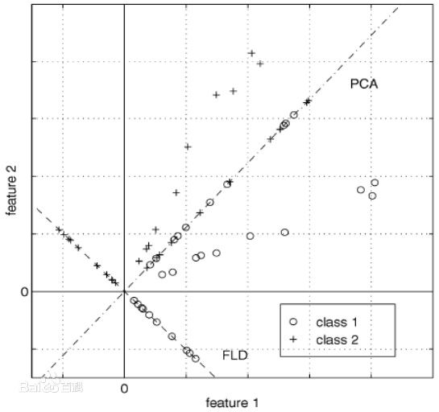
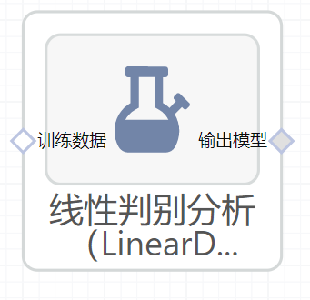

# 线性判别分析（LinearDiscriminantAnalysis）使用文档
| 组件名称 | 线性判别分析（LinearDiscriminantAnalysis） |  |  |
| --- | --- | --- | --- |
| 工具集 | 机器学习 |  |  |
| 组件作者 | 雪浪云-墨文 |  |  |
| 文档版本 | 1.0 |  |  |
| 功能 | 线性判别分析（LinearDiscriminantAnalysis）算法 |  |  |
| 镜像名称 | ml_components:3 |  |  |
| 开发语言 | Python |  |  |

## 组件原理
线性判别分析(linear discriminant analysis，LDA)是对费舍尔的线性鉴别方法的归纳，这种方法使用统计学，模式识别和机器学习方法，试图找到两类物体或事件的特征的一个线性组合，以能够特征化或区分它们。所得的组合可用来作为一个线性分类器，或者，更常见的是，为后续的分类做降维处理。

LDA与方差分析（ANOVA）和回归分析紧密相关，这两种分析方法也试图通过一些特征或测量值的线性组合来表示一个因变量。然而，方差分析使用类别自变量和连续数因变量，而判别分析连续自变量和类别因变量（即类标签）。逻辑回归和概率回归比方差分析更类似于LDA，因为他们也是用连续自变量来解释类别因变量的。

LDA的基本假设是自变量是正态分布的，当这一假设无法满足时，在实际应用中更倾向于用上述的其他方法。LDA也与主成分分析（PCA）和因子分析紧密相关，它们都在寻找最佳解释数据的变量线性组合。LDA明确的尝试为数据类之间不同建立模型。 另一方面，PCA不考虑类的任何不同，因子分析是根据不同点而不是相同点来建立特征组合。判别的分析不同因子分析还在于，它不是一个相互依存技术：即必须区分出自变量和因变量（也称为准则变量）的不同。在对自变量每一次观察测量值都是连续量的时候，LDA能有效的起作用。当处理类别自变量时，与LDA相对应的技术称为判别反应分析。

## 输入桩
支持单个csv文件输入。
### 输入端子1

- **端口名称**：训练数据
- **输入类型**：Csv文件
- **功能描述**： 输入用于训练的数据
## 输出桩
支持sklearn模型输出。
### 输出端子1

- **端口名称**：输出模型
- **输出类型**：sklearn模型
- **功能描述**： 输出训练好的模型用于预测
## 参数配置
### 求解器

- **功能描述**：求解器
- **必选参数**：是
- **默认值**：solver
### 收缩参数

- **功能描述**：收缩参数：仅当求解器取值为"eigen"以及"lsqr" 。 auto：自动进行收缩； 0到1之间的浮点数：固定的收缩参数
- **必选参数**：是
- **默认值**：auto
### 类别的先验概率

- **功能描述**：类别的先验概率
- **必选参数**：否
- **默认值**：（无）
### N Components

- **功能描述**：是否计算模型截距
- **必选参数**：是
- **默认值**：true
### 奇异值阈值

- **功能描述**：奇异值阈值
- **必选参数**：否
- **默认值**：（无）
### Random State

- **功能描述**：随机种子
- **必选参数**：否
- **默认值**：（无）
### 需要训练

- **功能描述**：该模型是否需要训练，默认为需要训练。
- **必选参数**：是
- **默认值**：true

### 特征字段

- **功能描述：** 特征字段
- **必选参数：** 是
- **默认值：** （无）

### 识别字段

- **功能描述：** 目标字段
- **必选参数：** 是
- **默认值：** （无）
## 使用方法
- 将组件拖入到项目中
- 与前一个组件输出的端口连接（必须是csv类型）
- 点击运行该节点

