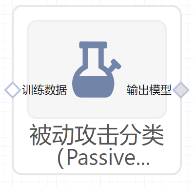

# 被动攻击分类（PassiveAggressiveClassifier）使用文档
| 组件名称 |被动攻击分类（PassiveAggressiveClassifier）|  |  |
| --- | --- | --- | --- |
| 工具集 | 机器学习 |  |  |
| 组件作者 | 雪浪云-墨文 |  |  |
| 文档版本 | 1.0 |  |  |
| 功能 | 被动攻击分类（PassiveAggressiveClassifier）算法|  |  |
| 镜像名称 | ml_components:3 |  |  |
| 开发语言 | Python |  |  |

## 组件原理
被动攻击算法适用于大规模学习的算法。它和感知器一样不需要学习率。然而，与感知器相反，它有一个正则化参数c。

- 在样本分类正确 且模型对可能性的预测准确（程度大于一）时，模型不做调整（这里体现出了被动）

- 在样本分类正确 但模型对可能性的预测有失偏颇（不太准确）时，模型做出轻微的调整

- 在样本分类错误时，模型做出较大的调整（体现出较强的“攻击性”）

核心算法步骤如下：

## 输入桩
支持单个csv文件输入。
### 输入端子1

- **端口名称**：训练数据
- **输入类型**：Csv文件
- **功能描述**： 输入用于训练的数据
## 输出桩
支持sklearn模型输出。
### 输出端子1

- **端口名称**：输出模型
- **输出类型**：sklearn模型
- **功能描述**： 输出训练好的模型用于预测
## 参数配置
### C

- **功能描述**：最大步长(正则化)
- **必选参数**：是
- **默认值**：1
### Fit Intercept

- **功能描述**:：是否计算模型截距
- **必选参数**：是
- **默认值**：true
### 最大迭代次数

- **功能描述**：模型训练时的最大迭代次数
- **必选参数**：是
- **默认值**：1000
### tol

- **功能描述**：残差的最大范数
- **必选参数**：否
- **默认值**：（无）
### 早停

- **功能描述**：当验证分数没有提高时，是否使用提前停止来终止训练
- **必选参数**：是
- **默认值**：false
### 验证集比例

- **功能描述**：训练集中用作验证集数据的比例
- **必选参数**：是
- **默认值**：0.1
### 验证得分不变的最大次数

- **功能描述**：在提前停止之前验证机得分没有提高的迭代次数
- **必选参数**：是
- **默认值**：5
### shuffle

- **功能描述**：每轮训练是否打乱数据
- **必选参数**：是
- **默认值**：true
### 损失函数

- **功能描述**：训练时使用的损失函数
- **必选参数**：是
- **默认值**：ginge
### epsilon

- **功能描述**：如果当前预测和正确标签之间的差异低于该阈值，则不更新模型
- **必选参数**：是
- **默认值**：0.1
### Random State

- **功能描述**：随机种子
- **必选参数**：否
- **默认值**：（无）
### 是否计算SGD

- **功能描述**：是否计算随机梯度下降权重的平均值
- **必选参数**：是
- **默认值**：false
### 需要训练

- **功能描述**：该模型是否需要训练，默认为需要训练。
- **必选参数**：是
- **默认值**：true
### 特征字段

- **功能描述**：特征字段
- **必选参数**：是
- **默认值**：（无）
### 识别字段

- **功能描述**：识别字段
- **必选参数**：是
- **默认值**：（无）
## 使用方法
- 将组件拖入到项目中
- 与前一个组件输出的端口连接（必须是csv类型）
- 点击运行该节点

