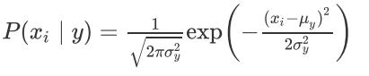
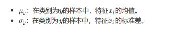

# 高斯朴素贝叶斯（GaussianNB）使用文档
| 组件名称 |高斯朴素贝叶斯（GaussianNB）|  |  |
| --- | --- | --- | --- |
| 工具集 | 机器学习 |  |  |
| 组件作者 | 雪浪云-墨文 |  |  |
| 文档版本 | 1.0 |  |  |
| 功能 | 高斯朴素贝叶斯（GaussianNB）算法|  |  |
| 镜像名称 | ml_components:3 |  |  |
| 开发语言 | Python |  |  |

## 组件原理

在sklearn中，提供了若干种朴素贝叶斯的实现算法，不同的朴素贝叶斯算法，主要是对P(xi|y)的分布假设不同，进而采用不同的参数估计方式。我们能够发现，朴素贝叶斯算法，主要就是计算P(xi|y)，一旦P(xi|y)确定，最终属于每个类别的概率，自然也就迎刃而解了。、

高斯朴素贝叶斯适用于连续变量，其假定各个特征xi在各个类别y下是服从正态分布的，算法内部使用正态分布的概率密度函数来计算概率如下：

计算方式如下：

高斯朴素贝叶斯模型是假设条件概率P(X=x|Y=c_k)是多元高斯分布,另一方面,由之前的特征的条件独立性假设,我们就可以通过对每个特征的条件概率建模,每个特征的条件概率N(\mu_t,\sigma_t^2)也服从高斯分布.

先验概率和之前的估算方法相同,不再描述.主要是对高斯分布的均值和方差的估计,采用的方法仍然是极大似然估计.
## 输入桩
支持单个csv文件输入。
### 输入端子1

- **端口名称**：训练数据
- **输入类型**：Csv文件
- **功能描述**： 输入用于训练的数据
## 输出桩
支持sklearn模型输出。
### 输出端子1

- **端口名称**：输出模型
- **输出类型**：sklearn模型
- **功能描述**： 输出训练好的模型用于预测
## 参数配置
### 平滑参数

- **功能描述**：加性(拉普拉斯/利德斯通)平滑参数，0代表不进行平滑操作
- **必选参数**：是
- **默认值**：0
### 类别的先验概率

- **功能描述**：以逗号分隔
- **必选参数**：否
- **默认值**：（无）
### 需要训练

- **功能描述**：该模型是否需要训练，默认为需要训练。
- **必选参数**：是
- **默认值**：true
### 特征字段

- **功能描述**：特征字段
- **必选参数**：是
- **默认值**：（无）
### 识别字段

- **功能描述**：识别字段
- **必选参数**：是
- **默认值**：（无）
## 使用方法
- 将组件拖入到项目中
- 与前一个组件输出的端口连接（必须是csv类型）
- 点击运行该节点

