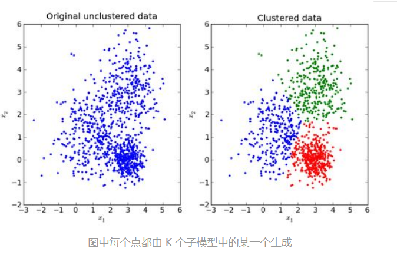
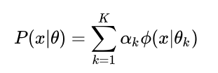

# 高斯混合（GaussiannMixture）使用文档
| 组件名称 |高斯混合（GaussiannMixture）|  |  |
| --- | --- | --- | --- |
| 工具集 | 机器学习 |  |  |
| 组件作者 | 雪浪云-墨文 |  |  |
| 文档版本 | 1.0 |  |  |
| 功能 | 高斯混合（GaussiannMixture）算法|  |  |
| 镜像名称 | ml_components:3 |  |  |
| 开发语言 | Python |  |  |

## 组件原理
混合模型是一个可以用来表示在总体分布（distribution）中含有 K 个子分布的概率模型，换句话说，混合模型表示了观测数据在总体中的概率分布，它是一个由 K 个子分布组成的混合分布。混合模型不要求观测数据提供关于子分布的信息，来计算观测数据在总体分布中的概率。

高斯混合模型可以看作是由 K 个单高斯模型组合而成的模型，这 K 个子模型是混合模型的隐变量（Hidden variable）。一般来说，一个混合模型可以使用任何概率分布，这里使用高斯混合模型是因为高斯分布具备很好的数学性质以及良好的计算性能。

举个不是特别稳妥的例子，比如我们现在有一组狗的样本数据，不同种类的狗，体型、颜色、长相各不相同，但都属于狗这个种类，此时单高斯模型可能不能很好的来描述这个分布，因为样本数据分布并不是一个单一的椭圆，所以用混合高斯分布可以更好的描述这个问题，如下图所示：

高斯混合模型的概率分布为：

对于这个模型而言，参数  ，也就是每个子模型的期望、方差（或协方差）、在混合模型中发生的概率。

## 输入桩
支持单个csv文件输入。
### 输入端子1

- **端口名称**：训练数据
- **输入类型**：Csv文件
- **功能描述**： 输入用于训练的数据
### 输入端子2

- **端口名称**：用户提供的初始均值数据
- **输入类型**：npy文件
- **功能描述**： 输入提供的初始均值数据，可以不连
### 输入端子3

- **端口名称**：用户提供的初始精度数据即协方差矩阵的倒数
- **输入类型**：npy文件
- **功能描述**： 输入提供的初始精度数据即协方差矩阵的倒数，可以不连
## 输出桩
支持sklearn模型输出。
### 输出端子1

- **端口名称**：输出模型
- **输出类型**：sklearn模型
- **功能描述**： 输出训练好的模型用于预测
## 参数配置
### N Component

- **功能描述**：混合成分的数量
- **必选参数**：是
- **默认值**：1
### 协方差类型

- **功能描述**：协方差类型
- **必选参数**：是
- **默认值**：full
### 收敛阈值

- **功能描述**：收敛阈值
- **必选参数**：是
- **默认值**：0.001
### 非负正则化参数

- **功能描述**：添加到协方差对角线的非负正则化
- **必选参数**：是
- **默认值**：0.000001
### 最大迭代次数

- **功能描述**：训练时执行的最大迭代次数
- **必选参数**：是
- **默认值**：100
### 初始化次数

- **功能描述**：要执行的初始化次数
- **必选参数**：是
- **默认值**：1
### 初始化方法

- **功能描述**：初始化方法
- **必选参数**：是
- **默认值**：kmeans
### Random State

- **功能描述**：随机种子
- **必选参数**：否
- **默认值**：（无）
### 并行度

- **功能描述**：训练时的并行度
- **必选参数**：是
- **默认值**：1
### 需要训练

- **功能描述**：该模型是否需要训练，默认为需要训练。
- **必选参数**：是
- **默认值**：true
### 特征字段

- **功能描述**：特征字段
- **必选参数**：是
- **默认值**：（无）
### 识别字段

- **功能描述**：识别字段
- **必选参数**：是
- **默认值**：（无）
## 使用方法
- 将组件拖入到项目中
- 与前一个组件输出的端口连接（必须是csv类型）
- 点击运行该节点

