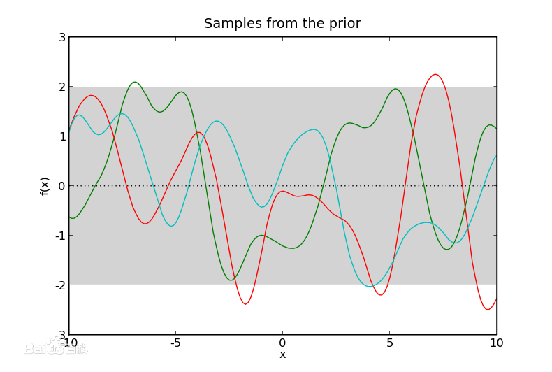

# 高斯过程分类（GaussianProcessClassifier）使用文档
| 组件名称 |高斯过程分类（GaussianProcessClassifier）|  |  |
| --- | --- | --- | --- |
| 工具集 | 机器学习 |  |  |
| 组件作者 | 雪浪云-墨文 |  |  |
| 文档版本 | 1.0 |  |  |
| 功能 | 高斯过程分类（GaussianProcessClassifier）算法|  |  |
| 镜像名称 | ml_components:3 |  |  |
| 开发语言 | Python |  |  |

## 组件原理
高斯过程（Gaussian Process, GP）是概率论和数理统计中随机过程（stochastic process）的一种，是一系列服从正态分布的随机变量（random variable）在一指数集（index set）内的组合。

高斯过程中任意随机变量的线性组合都服从正态分布，每个有限维分布都是联合正态分布，且其本身在连续指数集上的概率密度函数即是所有随机变量的高斯测度，因此被视为联合正态分布的无限维广义延伸。高斯过程由其数学期望和协方差函数完全决定，并继承了正态分布的诸多性质。

高斯过程的例子包括维纳过程、奥恩斯坦-乌伦贝克过程等。对高斯过程进行建模和预测是机器学习、信号处理等领域的重要内容，其中常见的模型包括高斯过程回归（Gaussian Process Regression, GPR）和高斯过程分类（Gaussian Process Classification, GPC） 。高斯过程的命名来自德国数学家卡尔·弗里德里希·高斯（Carl Friedrich Gauss）以纪念其提出正态分布概念。

## 输入桩
支持单个csv文件输入。
### 输入端子1

- **端口名称**：训练数据
- **输入类型**：Csv文件
- **功能描述**： 输入用于训练的数据
### 输入端子2

- **端口名称**：输入核函数
- **输入类型**：sklearn模型
- **功能描述**： 输入用于训练的核函数
## 输出桩
支持sklearn模型输出。
### 输出端子1

- **端口名称**：输出模型
- **输出类型**：sklearn模型
- **功能描述**： 输出训练好的模型用于预测
## 参数配置
### 优化器

- **功能描述**：优化核参数的优化器
- **必选参数**：是
- **默认值**：optimizer
### 重新启动次数

- **功能描述**：优化器为寻找内核参数而重新启动的次数
- **必选参数**：是
- **默认值**：3
### 最大迭代次数

- **功能描述**：最大迭代次数
- **必选参数**：是
- **默认值**：100
### 多类别分类策略

- **功能描述**：多类别分类策略
- **必选参数**：是
- **默认值**：multiclass
### Random State

- **功能描述**：随机种子
- **必选参数**：否
- **默认值**：（无）
### 并行度

- **功能描述**：训练时的并行度
- **必选参数**：是
- **默认值**：1
### 需要训练

- **功能描述**：该模型是否需要训练，默认为需要训练。
- **必选参数**：是
- **默认值**：true
### 特征字段

- **功能描述**：特征字段
- **必选参数**：是
- **默认值**：（无）
### 识别字段

- **功能描述**：识别字段
- **必选参数**：是
- **默认值**：（无）
## 使用方法
- 将组件拖入到项目中
- 与前一个组件输出的端口连接（必须是csv类型）
- 点击运行该节点

