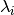
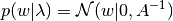
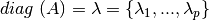
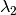
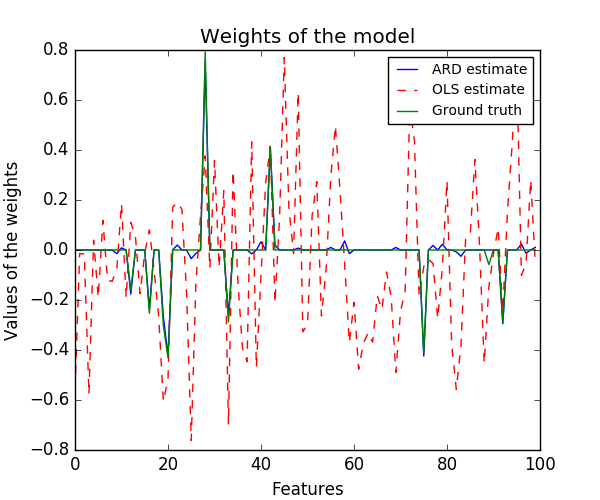
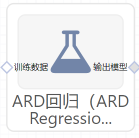

#ARD回归（ARDRegression）使用文档
| 组件名称 |ARD回归（ARDRegression）|  |  |
| --- | --- | --- | --- |
| 工具集 | 机器学习 |  |  |
| 组件作者 | 雪浪云-墨文 |  |  |
| 文档版本 | 1.0 |  |  |
| 功能 | ARD回归（ARDRegression）算法|  |  |
| 镜像名称 | ml_components:3 |  |  |
| 开发语言 | Python |  |  |

## 组件原理
ARDRegression 和 `Bayesian Ridge Regression`_ 非常相似，但是主要针对稀疏权重 w。 ARDRegression 提出一个不同于 w 的先验，通过弱化高斯分布为球形的假设。

相反，w的分布假设为一个平行轴的椭圆高斯分布。

也就是说，每个权重 来自于一个中心在0点，精度为的高斯分布:

同 `Bayesian Ridge Regression`_ 形成对比，w每一维都有一个标准差，所有的先验选择和由给定超参数和的gamma分布一样。

## 输入桩
支持单个csv文件输入。
### 输入端子1

- **端口名称**：训练数据
- **输入类型**：Csv文件
- **功能描述**： 输入用于训练的数据
## 输出桩
支持sklearn模型输出。
### 输出端子1

- **端口名称**：输出模型
- **输出类型**：sklearn模型
- **功能描述**： 输出训练好的模型用于预测
## 参数配置
### 最大迭代次数

- **功能描述**：模型训练的最大迭代次数
- **必选参数**：是
- **默认值**：300
### tol

- **功能描述**：停止迭代的条件
- **必选参数**：是
- **默认值**：0.0001
### alpha1

- **功能描述**：超参数，alpha参数之前的Gamma分布的形状参数
- **必选参数**：是
- **默认值**：0.000001
### alpha2

- **功能描述**：超参数，alpha参数之前的Gamma分布的逆标度参数(速率参数)
- **必选参数**：是
- **默认值**：0.000001
### lambda1

- **功能描述**：超参数，lambda参数之前的Gamma分布的形状参数
- **必选参数**：是
- **默认值**：0.000001
### lambda2

- **功能描述**：超参数，lambda参数之前的Gamma分布的逆标度参数(速率参数)
- **必选参数**：是
- **默认值**：0.000001
### Compute Score

- **功能描述**：是否计算模型每一步的目标函数
- **必选参数**：是
- **默认值**：false
### Threshold Lambda

- **功能描述**：从计算中移除(修剪)高精度权重的阈值
- **必选参数**：是
- **默认值**：10000
### Fit Intercept

- **功能描述**：是否计算模型截距
- **必选参数**：是
- **默认值**：true
### 是否进行归一化

- **功能描述**：是否对数据进行归一化处理
- **必选参数**：是
- **默认值**：false
### 需要训练

- **功能描述**：该模型是否需要训练，默认为需要训练。
- **必选参数**：是
- **默认值**：true
### 特征字段

- **功能描述**：特征字段
- **必选参数**：是
- **默认值**：（无）
### 识别字段

- **功能描述**：识别字段
- **必选参数**：是
- **默认值**：（无）
## 使用方法
- 将组件拖入到项目中
- 与前一个组件输出的端口连接（必须是csv类型）
- 点击运行该节点

